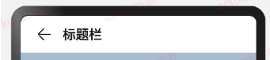

# Navigation

本文档基于 OpenHarmony5.0 版本 但我的测试 SDK 为 API 11

1. [Introduction](#introduction)
2. [简单案例](#简单案例)
3. [参数介绍](#参数介绍)
4. [基础属性介绍](#基础属性介绍)
5. [设置页面显示模式](#设置页面显示模式)
   - [split 页面案例](#split页面案例)
6. [设置标题栏模式](#设置标题栏模式)
7. [设置工具栏](#设置工具栏)
8. [路由操作](#路由操作)

## Introduction

Navigation 组件一般作为**页面布局的根容器**，它提供了一系列属性方法来设置页面的**标题栏**、**工具栏**以及**菜单栏**的各种展示样式。

## 简单案例

Navigation 的定义不需要传递相关参数，我们先看下 Navigation 的最简单样例：


```typescript
Navigation() {                         // Navigation只能包含一个子组件
  Text('title')
    .textAlign(TextAlign.Center)
    .fontSize(30)
    .width('100%')
    .backgroundColor('#aabbcc')
}
.size({width: '100%', height: '100%'}) // Navigation只设置了size，没有设置任何其它属性
```

## 参数介绍

## 基础属性介绍

| Attributes  | title      | hideBackButton   | hideTitleBar | menus                    |
| :---------- | :--------- | :--------------- | :----------- | :----------------------- |
| **Usage**   | 导航栏标题 | 是否隐藏返回按钮 | 显示标题栏   | 设置标题栏右上角的菜单项 |
| **Default** | -          | 不隐藏           | 显示         | -                        |
| **Type**    | string     | boolean          | boolean      | object                   |

- title

> 设置导航栏的标题，当参数类型为 string 时，可以直接设置标题，但样式不支修改

> 

> 当参数为 CustomBuilder 时，可以自定义标题样式。

> 

参考代码如下：

```typescript
@Entry @Component struct ComponentTest {

  @Builder title() {// 通过Builder自定义标题栏，可以灵活的设置标题样式
    Row() {
      Text('Builder标题')
        .fontSize(20)
    }
    .width('100%')
    .height(55)
    .backgroundColor(Color.Pink)
  }

  build() {
    Navigation() {
      Text('title')
        .textAlign(TextAlign.Center)
        .fontSize(30)
        .size({width: '100%', height: '100%'})
        .backgroundColor('#aabbcc')
    }
    .size({width: '100%', height: '100%'})
    .title(this.title())// 使用自定义的标题栏
  }
}
```

> **NOTE:** toolBar 方法在 API11 中被废弃，我们选择使用 CustomBuilder 来构建 tabBar 具体方法在 tab 章节介绍

- menus
  > 设置标题栏右上角的菜单项，当参数为 CustomBuilder 时可以自定义菜单项。

当参数为 NavigationMenuItem 数组时，参数说明如下：

- value：菜单项的显示文本。
- icon：菜单项的显示图标路径。
- action：点击菜单项的事件回调。

```typescript
    .menus([
      {
        value: "搜索",
        icon: "pages/icon_search.png",
        action: () => {
          prompt.showToast({message: "搜索"})
        }
      },
      {
        value: "扫码",
        icon: "pages/icon_scan.png",
        action: () => {
          prompt.showToast({message: "扫码"})
        }
      }
    ])
```

## 设置页面显示模式

通过`.mode`属性设置
| type | NavigationMode.Auto | NavigationMode.Stack | NavigationMode.Split |
| :---------- | :--------- | :--------------- | :----------------------- |
| **Usage** | 自适应模式(默认)| 单页面显示模式 | 分栏布局模式 |

- 自适应模式

当页面宽度大于等于一定阈值( API version 9 及以前：520vp，API version 10 及以后：600vp )时，Navigation 组件采用分栏模式，反之采用单栏模式

- 单页面模式(单栏模式)


```typescript
Navigation() {
  // ...
}
.mode(NavigationMode.Stack)
```

- 分栏布局模式(分栏模式)


```typescript
Navigation() {
  // ...
}
.mode(NavigationMode.Split)
```

### split 页面案例


```typescript
@Entry
@Component
struct NavigationExample {
  @State TooTmp: ToolbarItem = {'value': "func", 'icon': "./image/ic_public_highlights.svg", 'action': ()=> {}}
  @Provide('pageInfos') pageInfos: NavPathStack = new NavPathStack()
  private arr: number[] = [1, 2, 3];

  @Builder
  PageMap(name: string) {
    if (name === "NavDestinationTitle1") {
      pageOneTmp()
    } else if (name === "NavDestinationTitle2") {
      pageTwoTmp()
    } else if (name === "NavDestinationTitle3") {
      pageThreeTmp()
    }
  }

  build() {
    Column() {
      Navigation(this.pageInfos) {
        TextInput({ placeholder: 'search...' })
          .width("90%")
          .height(40)
          .backgroundColor('#FFFFFF')

        List({ space: 12 }) {
          ForEach(this.arr, (item:number) => {
            ListItem() {
              Text("NavRouter" + item)
                .width("100%")
                .height(72)
                .backgroundColor('#FFFFFF')
                .borderRadius(24)
                .fontSize(16)
                .fontWeight(500)
                .textAlign(TextAlign.Center)
                .onClick(()=>{
                  this.pageInfos.pushPath({ name: "NavDestinationTitle" + item})
                })
            }
          }, (item:number) => item.toString())
        }
        .width("90%")
        .margin({ top: 12 })
      }
      .title("主标题")
      .mode(NavigationMode.Split)
      .navDestination(this.PageMap)
      .menus([
        {value: "", icon: "./image/ic_public_search.svg", action: ()=> {}},
        {value: "", icon: "./image/ic_public_add.svg", action: ()=> {}},
        {value: "", icon: "./image/ic_public_add.svg", action: ()=> {}},
        {value: "", icon: "./image/ic_public_add.svg", action: ()=> {}},
        {value: "", icon: "./image/ic_public_add.svg", action: ()=> {}}
      ])
      .toolbarConfiguration([this.TooTmp, this.TooTmp, this.TooTmp])
    }
    .height('100%')
    .width('100%')
    .backgroundColor('#F1F3F5')
  }
}

// PageOne.ets
@Component
export struct pageOneTmp {
  @Consume('pageInfos') pageInfos: NavPathStack;
  build() {
    NavDestination() {
      Column() {
        Text("NavDestinationContent1")
      }.width('100%').height('100%')
    }.title("NavDestinationTitle1")
    .onBackPressed(() => {
      const popDestinationInfo = this.pageInfos.pop() // 弹出路由栈栈顶元素
      console.log('pop' + '返回值' + JSON.stringify(popDestinationInfo))
      return true
    })
  }
}

// PageTwo.ets
@Component
export struct pageTwoTmp {
  @Consume('pageInfos') pageInfos: NavPathStack;
  build() {
    NavDestination() {
      Column() {
        Text("NavDestinationContent2")
      }.width('100%').height('100%')
    }.title("NavDestinationTitle2")
    .onBackPressed(() => {
      const popDestinationInfo = this.pageInfos.pop() // 弹出路由栈栈顶元素
      console.log('pop' + '返回值' + JSON.stringify(popDestinationInfo))
      return true
    })
  }
}

// PageThree.ets
@Component
export struct pageThreeTmp {
  @Consume('pageInfos') pageInfos: NavPathStack;
  build() {
    NavDestination() {
      Column() {
        Text("NavDestinationContent3")
      }.width('100%').height('100%')
    }.title("NavDestinationTitle3")
    .onBackPressed(() => {
      const popDestinationInfo = this.pageInfos.pop() // 弹出路由栈栈顶元素
      console.log('pop' + '返回值' + JSON.stringify(popDestinationInfo))
      return true
    })
  }
}
```

## 设置标题栏模式

通过`.titleMode`属性设置
| type | NavigationTitleMode.Mini | NavigationTitleMode.Full |
| :---------- | :--------- | :----------------------- |
| **Usage** | Mini 模式| Full 模式 |

## 设置工具栏

工具栏位于`Navigation`组件的底部，可以通过`toolbarConfiguration`属性进行设置

```typescript
let TooTmp: ToolbarItem = {'value': "func", 'icon': "./image/ic_public_highlights.svg", 'action': ()=> {}}

let TooBar: ToolbarItem[] = [TooTmp,TooTmp,TooTmp]
Navigation() {
  // ...
}
.toolbarConfiguration(TooBar)
```

## 路由操作

Navigation 路由相关的操作都是基于页面栈 `NavPathStack` 提供的方法进行，每个`Navigation`都需要创建并传入一个 NavPathStack 对象，用于管理页面。主要涉及页面跳转、页面返回、页面替换、页面删除、参数获取、路由拦截等功能。

### 页面跳转

`NavPathStack`通过 Push 相关的接口去实现页面跳转的功能，主要分为以下三类:

- 普通跳转，通过页面的 name 去跳转，并可以携带 param

```typescript
this.pageStack.pushPath({ name: "PageOne", param: "PageOne Param" });
this.pageStack.pushPathByName("PageOne", "PageOne Param");
```

- 带返回回调的跳转，跳转时添加 onPop 回调，能在页面出栈时获取返回信息，并进行处理

```typescript
this.pageStack.pushPathByName("PageOne", "PageOne Param", (popInfo) => {
  console.log(
    "Pop page name is: " +
      popInfo.info.name +
      ", result: " +
      JSON.stringify(popInfo.result)
  );
});
```

- 带错误码的跳转，跳转结束会触发异步回调，返回错误码信息

```typescript
this.pageStack
  .pushDestinationByName("PageOne", "PageOne Param")
  .catch((error: BusinessError) => {
    console.error(
      `Push destination failed, error code = ${error.code}, error.message = ${error.message}.`
    );
  })
  .then(() => {
    console.info("Push destination succeed.");
  });
```

### 页面返回

NavPathStack 通过 Pop 相关接口去实现页面返回功能

```typescript
// 返回到上一页
this.pageStack.pop();
// 返回到上一个PageOne页面
this.pageStack.popToName("PageOne");
// 返回到索引为1的页面
this.pageStack.popToIndex(1);
// 返回到根首页（清除栈中所有页面）
this.pageStack.clear();
```

### 页面替换

NavPathStack 通过 Replace 相关接口去实现页面替换功能

```typescript
// 将栈顶页面替换为PageOne
this.pageStack.replacePath({ name: "PageOne", param: "PageOne Param" });
this.pageStack.replacePathByName("PageOne", "PageOne Param");
```

### 页面删除

NavPathStack 通过 Remove 相关接口去实现删除页面栈中特定页面的功能

```typescript
// 删除栈中name为PageOne的所有页面
this.pageStack.removeByName("PageOne");
// 删除指定索引的页面
this.pageStack.removeByIndexes([1, 3, 5]);
```

### 参数获取

NavPathStack 通过 Get 相关接口去获取页面的一些参数

```typescript
// 获取栈中所有页面name集合
this.pageStack.getAllPathName();
// 获取索引为1的页面参数
this.pageStack.getParamByIndex(1);
// 获取PageOne页面的参数
this.pageStack.getParamByName("PageOne");
// 获取PageOne页面的索引集合
this.pageStack.getIndexByName("PageOne");
```

### 路由拦截
