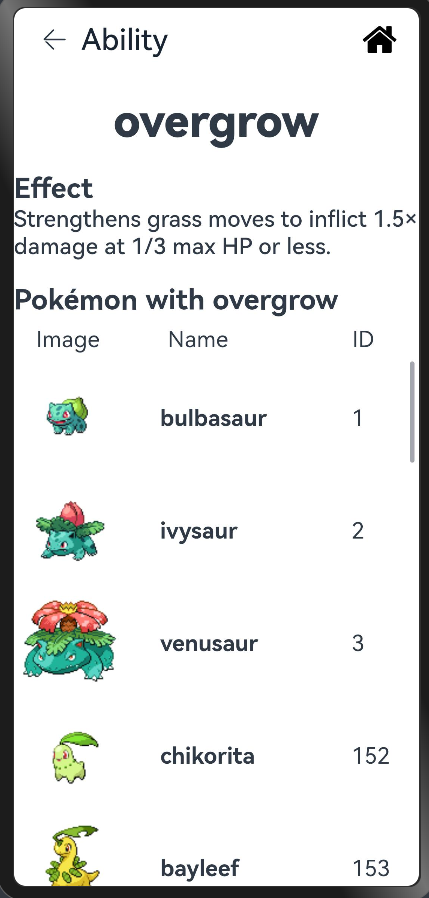

# PokemonList

## Introduction 
`Pokemon Book` is a Pokémon type and attribute details viewing tool that helps users quickly understand Pokémon's attribute restraint relationships, skill effects, and related data.


## Overview





This is a documentation lists all the problems or noticeable thing during the app development.
### Table of content

[异步数据加载的时间差](#异步数据加载的时间差)
[如何合理封装Json数据](#如何合理封装json数据)
[封装嵌套JSON数据结构](#封装嵌套json数据结构)
[截取URL中部分数据](#截取url中部分数据)
[forEach渲染的列表数据为undefined](#foreach渲染的列表数据为undefined)
##  异步数据加载的时间差

#### 问题背景
这是个相对麻烦的问题，因为涉及到了数据渲染的时间差,比如我在渲染`Index`页面的时候列表还未渲染完成，我们就访问了未渲染完成的宝可梦单元来获取`type`,结果导致报错

(遇到的问题是由于异步加载和渲染之间的时间差导致的。当数据尚未完全加载时，代码尝试访问未定义的属性，导致编译错误 "Object is possibly 'undefined'.")
#### 解决方法
 我们必须确保异步操作的顺序
通过 `Promise` 或 `async/await` 确保所有数据加载完成后再执行后续操作。例如，可以使用 `Promise.all` 来处理多个异步调用。

大体逻辑如下：
```typescript
        const list = await source.getPokemonList();
        this.pokeList = list;
        // 获取每个宝可梦的类型，并存储到 typeList
        const infoPromises = this.pokeList.map((item, index) =>
        source.getPokemonType(index).then((types) => {
          this.typeList[index] = types; // 存储类型数组到二维数组 typeList
        })
        );

        await Promise.all(infoPromises); // 等待所有异步任务完成
```


##  如何合理封装Json数据
#### 问题背景
在编写 `DataSource` 数据源的时候无法解析请求的 `Http Get` JSON数据。

#### 解决方法
我们需要合理地设计 `model` 或者 `interface` 才能进行请求， 根据请求的模型结构再进一步的拆分
```typescript
  async getTypeDetail(url: string): Promise<DamageRelations> {
    return new Promise<DamageRelations>((resolve, reject) => {
      let httpRequest = http.createHttp()
      httpRequest.request(`${url}`, (err, data) => {
        if (!err) {
          try {
            // parse requested JSON data and receive with designed model
            let responseData: PokemonTypeData = JSON.parse(data.result as string)
            const res: DamageRelations = responseData.damage_relations
            resolve(res)
          } catch (parseErr) {
            console.error('JSON Parse Error', parseErr);
            reject(err);
          }
        } else {
          console.error('HTTP Error:', err);
          reject(err);
        }
      })
    })
  }
```
以上述例子为例，在我们调用了 `http.createHttp()` 之后， 我们需要合适的数据类型来接收解析的数据 `PokemonTypeData`在上面例子中是

此外，每一个拆分的结构也必须进行合理的封装后才能使用

##  封装嵌套JSON数据结构
解决此问题使用了递归函数

```typescript
this.evolutionSpecies = this.extractSpeciesNames(this.pokeEvolution.chain as EvolutionChain)

  // 提取物种名称的递归方法
  extractSpeciesNames(chain: EvolutionChain, result: Species[] = []): Species[] {
    result.push({
      name: chain.species.name,
      url: chain.species.url
    });
    chain.evolves_to.forEach((nextChain) => {
      this.extractSpeciesNames(nextChain, result);
    });
    return result;
  }
```


## 截取URL中部分数据
#### 问题描述
在某些特殊的情况我们需要截取一段特定格式的部分字符串, 在本例子中我们需要截取 `url` 最后位置的数字

#### 解决方法
```typescript
function extractLastNumber(url: string): number {
  const parts = url.split('/').filter((part) => part !== ''); // 按斜杠分割，并过滤掉空字符串
  const lastPart = parts[parts.length - 1]; // 获取最后一部分
  return parseInt(lastPart, 10); // 转换为数字并返回
}
```

## forEach渲染的列表数据为undefined
在 forEach 内部直接访问异步更新的值可能会导致数据状态不一致。可以改用 for 循环进行逐一处理
```typescript
if (Array.isArray(this.effectEntry))
for(const item of this.effectEntry){
    if (item.language?.name === 'en') {
    this.effectInfo.language = item.language;
    this.effectInfo.short_effect = item.short_effect;
    break;
    }
}
```
