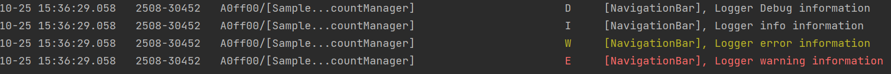
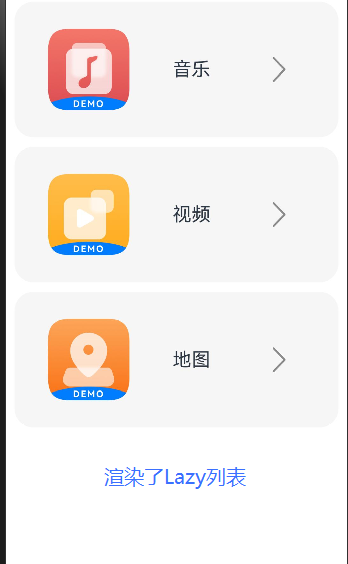

# ArkTS-simple-demo-usage

1. [AlertDialog Window](##alertdialog-window)
2. [Topbar template](##topbar-template)
3. [Logger template](##logger-template)
4. [LazyForEach Usage](##lazyforeach-usage)
   

## AlertDialog Window
```typescript
        Button('Show alertDialog Window')
          .onClick(() => {
            AlertDialog.show(
              {
                title: 'AlertDialog title',
                message: 'Message to be shown',
                primaryButton: {
                  value: 'Confirm',
                  action: () => {
                    // todo: callback function when first button clicked
                    // router.pushUrl({
                    //   url: this.url,
                    // })
                  }
                },
                secondaryButton: {
                  value: 'Cancel',
                  action: () => {
                    // todo: callback function when second button clicked
                    // console.log('cancel click')
                  }
                },
                cancel: () => {
                  // todo: callback function when window close
                }
              })
          })
```
### Effect:
<div>
        
</div>

## Topbar template
```typescript
  build() {
    Row() {
      Row() {
        Row() {
          Image($r('app.media.left'))
            .objectFit(ImageFit.Contain)
            .width('10%')
          Text("back")
            .fontSize(18)
            .textAlign(TextAlign.End)
            .fontColor(Color.White)
        }
        .id('back')
        .layoutWeight(1)


        Text('title')
          .fontSize(18)
          .fontColor(Color.White)
          .textAlign(TextAlign.Start)
          .margin({ right: '5%' })
      }
      .height('8%')
      .width('100%')
      .padding({ left: 15 })
      .backgroundColor('#0D9FFB')
      .constraintSize({ minHeight: 50 })
    }
  }
```
### Used Icons:
[left.png](icons/left.png)
### Effect:
<div>
        
</div>

## Logger Template
首先要创建一个文件 `ets/model/Logger.ets`
```typescript
/*
 * Copyright (c) 2022 Huawei Device Co., Ltd.
 * Licensed under the Apache License, Version 2.0 (the "License");
 * you may not use this file except in compliance with the License.
 * You may obtain a copy of the License at
 *
 *     http://www.apache.org/licenses/LICENSE-2.0
 *
 * Unless required by applicable law or agreed to in writing, software
 * distributed under the License is distributed on an "AS IS" BASIS,
 * WITHOUT WARRANTIES OR CONDITIONS OF ANY KIND, either express or implied.
 * See the License for the specific language governing permissions and
 * limitations under the License.
 */
import hilog from '@ohos.hilog'

class Logger {
  private domain: number
  private prefix: string
  private format: string = '%{public}s, %{public}s'

  constructor(prefix: string) {
    this.prefix = prefix
    this.domain = 0xFF00
  }

  debug(...args: any[]) {
    hilog.debug(this.domain, this.prefix, this.format, args)
  }

  info(...args: any[]) {
    hilog.info(this.domain, this.prefix, this.format, args)
  }

  warn(...args: any[]) {
    hilog.warn(this.domain, this.prefix, this.format, args)
  }

  error(...args: any[]) {
    hilog.error(this.domain, this.prefix, this.format, args)
  }
}

export default new Logger('[Sample_AppAccountManager]')
```
#### Usage
在想要使用的地方**import**并创建合适的Tag常数
```typescript
import Logger from '../model/Logger'

const TAG: string = '[NavigationBar]'
```

```typescript
Logger.info(TAG, `Logger Debug information`)
Logger.info(TAG, `Logger info information`)
Logger.info(TAG, `Logger error information`)
Logger.info(TAG, `Logger warning information`)
```
<div>
        
</div>

## LazyForEach Usage
### 1. 实现IDataSource接口
> **Note:** 照着拷贝
```typescript
// Basic implementation of IDataSource to handle data listener
class BasicDataSource implements IDataSource {
  private listeners: DataChangeListener[] = [];
  private originDataArray: string[] = [];

  public totalCount(): number {
    return 0;
  }

  public getData(index: number): string {
    return this.originDataArray[index];
  }

  // 该方法为框架侧调用，为LazyForEach组件向其数据源处添加listener监听
  registerDataChangeListener(listener: DataChangeListener): void {
    if (this.listeners.indexOf(listener) < 0) {
      console.info('add listener');
      this.listeners.push(listener);
    }
  }

  // 该方法为框架侧调用，为对应的LazyForEach组件在数据源处去除listener监听
  unregisterDataChangeListener(listener: DataChangeListener): void {
    const pos = this.listeners.indexOf(listener);
    if (pos >= 0) {
      console.info('remove listener');
      this.listeners.splice(pos, 1);
    }
  }

  // 通知LazyForEach组件需要重载所有子组件
  notifyDataReload(): void {
    this.listeners.forEach(listener => {
      listener.onDataReloaded();
    })
  }

  // 通知LazyForEach组件需要在index对应索引处添加子组件
  notifyDataAdd(index: number): void {
    this.listeners.forEach(listener => {
      listener.onDataAdd(index);
    })
  }

  // 通知LazyForEach组件在index对应索引处数据有变化，需要重建该子组件
  notifyDataChange(index: number): void {
    this.listeners.forEach(listener => {
      listener.onDataChange(index);
    })
  }

  // 通知LazyForEach组件需要在index对应索引处删除该子组件
  notifyDataDelete(index: number): void {
    this.listeners.forEach(listener => {
      listener.onDataDelete(index);
    })
  }

  // 通知LazyForEach组件将from索引和to索引处的子组件进行交换
  notifyDataMove(from: number, to: number): void {
    this.listeners.forEach(listener => {
      listener.onDataMove(from, to);
    })
  }
}
```
### 2. 实现自己的数据源类，下面的例子作为参考 但是我提供了更通用的模板在下面
> 需要按需调整完善该类的实现方法
### Used Icons
[music.png](icons/music.png),[video.png](icons/video.png),[map.png](icons/map.png)
```typescript
class MyDataSource extends BasicDataSource {
  private dataArray: Array<{
    img: Resource,
    text: Resource,
    name: string
  }> = [
    { img: $r('app.media.music'), text: $r('app.string.music'), name: 'Music' },
    { img: $r('app.media.video'), text: $r('app.string.video'), name: 'Video' },
    { img: $r('app.media.map'), text: $r('app.string.map'), name: 'Map' }
  ]

  public totalCount() {
    return this.dataArray.length
  }

  public getData(index: number) {
    return this.dataArray[index]
  }

  public addData(index: number) {
    this.dataArray.splice(index, 0)
    this.notifyDataAdd(index)
  }

  public pushData(index: number) {
    this.dataArray.push()
    this.notifyDataAdd(this.dataArray.length - 1)
  }

  public replaceData(result: any[]) {
    this.dataArray = result
  }
}
```
### 更通用的模板
```typescript
class MyDataSource extends BasicDataSource {
  private dataArray: string[] = [];

  public totalCount(): number {
    return this.dataArray.length;
  }

  public getData(index: number): string {
    return this.dataArray[index];
  }

  public addData(index: number, data: string): void {
    this.dataArray.splice(index, 0, data);
    this.notifyDataAdd(index);
  }

  public pushData(data: string): void {
    this.dataArray.push(data);
    this.notifyDataAdd(this.dataArray.length - 1);
  }
}
```
### 3. 创建数据源实例并为其添加数据
```typescript
@Component
export struct BundleInfo {
// 创建数据源 上面的例子对其初始化过了
  @State dataSet: MyDataSource = new MyDataSource()

  build() {
    Column() {
      //在需要渲染的地方使用LazyForEach并传入数据源实例
      LazyForEach(this.dataSet, item => {
        Row() {
          Image(item.img)
            .margin(10)
            .width('40%')
            .height('60%')
            .objectFit(ImageFit.Contain)

          Text(item.text)
            .margin(10)
            .fontSize(20)

          Image($r('app.media.right'))
            .margin(10)
            .width('15%')
            .height('20%')
            .layoutWeight(1)
            .objectFit(ImageFit.Contain)
        }
        .id(item.name + 'App')
        .margin(5)
        .width('95%')
        .height('20%')
        .borderRadius(20)
        .backgroundColor('#f6f6f6')
        .onClick(() => {
          router.push({
            url: 'pages/Login',
            params: {
              bundleName: item.name
            }
          })
        })
      }, item => item.name.toString())
    }
    .layoutWeight(1)
  }
}
```
<div>
        
</div>
