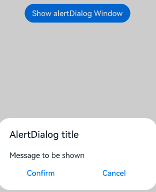
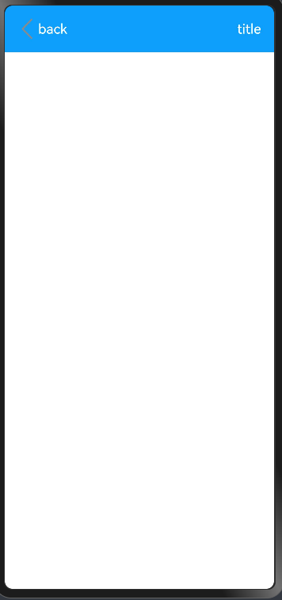

# ArkTS-simple-demo-usage
## AlertDialog Window
```typescript
        Button('Show alertDialog Window')
          .onClick(() => {
            AlertDialog.show(
              {
                title: 'AlertDialog title',
                message: 'Message to be shown',
                primaryButton: {
                  value: 'Confirm',
                  action: () => {
                    // todo: callback function when first button clicked
                    // router.pushUrl({
                    //   url: this.url,
                    // })
                  }
                },
                secondaryButton: {
                  value: 'Cancel',
                  action: () => {
                    // todo: callback function when second button clicked
                    // console.log('cancel click')
                  }
                },
                cancel: () => {
                  // todo: callback function when window close
                }
              })
          })
```
### Effect:
<div>
        
</div>

## Topbar template
```typescript
  build() {
    Row() {
      Row() {
        Row() {
          Image($r('app.media.left'))
            .objectFit(ImageFit.Contain)
            .width('10%')
          Text("back")
            .fontSize(18)
            .textAlign(TextAlign.End)
            .fontColor(Color.White)
        }
        .id('back')
        .layoutWeight(1)


        Text('title')
          .fontSize(18)
          .fontColor(Color.White)
          .textAlign(TextAlign.Start)
          .margin({ right: '5%' })
      }
      .height('8%')
      .width('100%')
      .padding({ left: 15 })
      .backgroundColor('#0D9FFB')
      .constraintSize({ minHeight: 50 })
    }
  }
```
### Used Icons:

### Effect:
<div>
        
</div>
