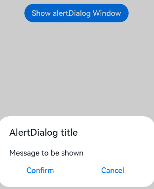

# ArkTS-simple-demo-usage
## AlertDialog Window
```typescript
        Button('Show alertDialog Window')
          .onClick(() => {
            AlertDialog.show(
              {
                title: 'AlertDialog title',
                message: 'Message to be shown',
                primaryButton: {
                  value: 'Confirm',
                  action: () => {
                    // todo: callback function when first button clicked
                    // router.pushUrl({
                    //   url: this.url,
                    // })
                  }
                },
                secondaryButton: {
                  value: 'Cancel',
                  action: () => {
                    // todo: callback function when second button clicked
                    // console.log('cancel click')
                  }
                },
                cancel: () => {
                  // todo: callback function when window close
                }
              })
          })
```
### Effect:
<div>
        
</div>
