# AppStore API 11

本文档展示了在构造基于 API9 Oniro 应用商城时遇到的问题

本文档使用 Deveco Studio 4.1 API version 11

1. [fonts 报错](#fonts报错)
2. [语法适配 globalThis 无法使用 windowStage](#语法适配-globalthis-无法使用-windowstage)
3. [resource 转 string 类型](#resource转string类型)
4. [ArkTS-no-definite-assignment](#ArkTS-no-definite-assignment)
5. [main_pages.json 页面必须有唯一入口](#main_pagesjson-页面必须有唯一入口)
6. [语法适配 globalThis 无法使用 abilityContext.filesDir](#语法适配-globalthis-无法使用-abilitycontextfilesdir)
7. [语法适配 for...in 无法使用](#语法适配-forin-无法使用)
   - [第一个新的问题(ArkTS 遍历对象数组)](#第一个新的问题arkts-遍历对象数组)
   - [第二个新的问题(Indexed access is not supported for fields)](#第二个新的问题indexed-access-is-not-supported-for-fields)
8. [Object.assign 报错](#objectassign报错)
9. [对象属性名称非标识符报错](#对象属性名称非标识符报错)
10. [.catch(err)报错](#catcherr报错)
11. [router 接收参数报错](#router接收参数报错)

实机测试发现的问题

1. [Web 组件无法通过参数渲染](#web组件无法通过参数渲染)
2. [服务器数据无法渲染](#服务器数据无法渲染)

<<<<<<< HEAD
项目开发新增需求
1. [网页加载过程中需要缓冲组件和连接失败页面](#网页加载过程中需要缓冲组件和连接失败页面)
2. [下拉实现刷新](#下拉实现刷新)

项目优化
=======
>>>>>>> fdf7bc662a48e34ae7b5ec0debc5109c6842f1a7
## fonts 报错

```
> hvigor ERROR: Error occurred when ark compiling for previewer: ArkTS:ERROR File: C:/Users/c84381641/DevEcoStudioProjects/appStore_sample/entry/src/main/font/fonts.ets:4:15
 Object literal must correspond to some explicitly declared class or interface (arkts-no-untyped-obj-literals)
```

#### 报错分析

在`fonts.ets`文件中， 使用了未明确声明类型的对象字面变量(object literal)

ArkTS 要求所有对象字面量都必须与某个显式声明的类或接口对应，以确保**类型安全**

```typescript
//define fonts as lists of objects
const fonts = {
  semi_bold: {
    familyName: "SemiBold",
    familySrc: "/font/PlusJakartaSans-semiBold.ttf",
  },
  bold: {
    familyName: "Bold",
    familySrc: "/font/PlusJakartaSans-Bold.ttf",
  },
  medium: {
    familyName: "Medium",
    familySrc: "/font/PlusJakartaSans-Medium.ttf",
  },
  light: {
    familyName: "Light",
    familySrc: "/font/PlusJakartaSans-Light.ttf",
  },
  regular: {
    familyName: "Regular",
    familySrc: "/font/PlusJakartaSans-Regular.ttf",
  },
  extraBold: {
    familyName: "ExtraBold",
    familySrc: "/font/PlusJakartaSans-ExtraBold.ttf",
  },
  italic: {
    familyName: "Italic",
    familySrc: "/font/PlusJakartaSans-Italic.ttf",
  },
};

export default fonts;
```

#### 解决方法

为 `fonts` 对象字面量创建一个显式的接口

```typescript
// 定义 Font 接口
interface Font {
  familyName: string;
  familySrc: string;
}

// 定义具体的 Fonts 对象类型
interface Fonts {
  semi_bold: Font;
  bold: Font;
  medium: Font;
  light: Font;
  regular: Font;
  extraBold: Font;
  italic: Font;
}

// 定义 fonts 对象
const fonts: Fonts = {
  semi_bold: {
    familyName: "SemiBold",
    familySrc: "/font/PlusJakartaSans-semiBold.ttf",
  },
  bold: {
    familyName: "Bold",
    familySrc: "/font/PlusJakartaSans-Bold.ttf",
  },
  medium: {
    familyName: "Medium",
    familySrc: "/font/PlusJakartaSans-Medium.ttf",
  },
  light: {
    familyName: "Light",
    familySrc: "/font/PlusJakartaSans-Light.ttf",
  },
  regular: {
    familyName: "Regular",
    familySrc: "/font/PlusJakartaSans-Regular.ttf",
  },
  extraBold: {
    familyName: "ExtraBold",
    familySrc: "/font/PlusJakartaSans-ExtraBold.ttf",
  },
  italic: {
    familyName: "Italic",
    familySrc: "/font/PlusJakartaSans-Italic.ttf",
  },
};

export default fonts;
```

> **Note** 在 ArkTS 中，不支持使用索引签名（indexed signatures）
> 因此，不能使用像 [key: string]: Font(下面例子) 这样的语法来定义一个对象类型

```typescript
// 定义 Fonts 对象的接口
interface Fonts {
  [key: string]: Font; // 允许有任意数量的字体，键为字符串，值为 Font 类型
}
```

> 为了避免使用索引签名，可以为每种字体显式定义其类型

```typescript
// 定义具体的 Fonts 对象类型
interface Fonts {
  semi_bold: Font;
  bold: Font;
  medium: Font;
  light: Font;
  regular: Font;
  extraBold: Font;
  italic: Font;
}
```

## 语法适配 globalThis 无法使用 windowStage

#### 报错信息


#### 参考文档

https://forums.openharmony.cn/forum.php?mod=viewthread&tid=1601

https://segmentfault.com/q/1010000045214058

由于无法为 globalThis 添加静态类型，只能通过查找的方式访问 globalThis 的属性，造成额外的性能开销。另外，无法为 globalThis 的属性标记类型，无法保证对这些属性操作的安全和高性能。因此 ArkTS 不支持 globalThis。

建议按照业务逻辑根据 import/export 语法实现数据在不同模块的传递。

必要情况下，可以通过构造的单例对象来实现全局对象的功能。(**说明：** 不能在 har 中定义单例对象，har 在打包时会在不同的 hap 中打包两份，无法实现单例。)

#### 解决方法

##### 步骤一

在 entryability 中将 windowStage 存储到全局 UI 变量中

> 目前 windowStage 只在 onWindowStageCreate 中存在。获取需要使用 AppStorage。

```typescript
  onWindowStageCreate(windowStage: window.WindowStage): void {
    // Main window is created, set main page for this ability
    hilog.info(0x0000, 'testTag', '%{public}s', 'Ability onWindowStageCreate');

    windowStage.loadContent('pages/Index', (err) => {
      if (err.code) {
        hilog.error(0x0000, 'testTag', 'Failed to load the content. Cause: %{public}s', JSON.stringify(err) ?? '');
        return;
      }

       AppStorage.setOrCreate("windowStage", windowStage);

      hilog.info(0x0000, 'testTag', 'Succeeded in loading the content.');
    });
  }
```

##### 步骤二

在 `changeLFS` 函数中获取 windowStage 通过 `AppStorage.get` 方法

```typescript
  changeLFS() {
    // 从 AppStorage 获取 windowStage 实例
    const windowStage = AppStorage.get<window.WindowStage>("windowStage");

    if (!windowStage) {
      console.error("windowStage is not available in AppStorage.");
      return;
    }

    if (this.currentIndex == 3) {
      WindowStageUtil.setLayoutFullScreen(windowStage, '#f3f4f6', WindowStageUtil.COLOR_BLACK, '#f7f7f7', WindowStageUtil.COLOR_BLACK);
    } else {
      WindowStageUtil.setLayoutFullScreen(windowStage, WindowStageUtil.COLOR_WHITE, WindowStageUtil.COLOR_BLACK, '#f7f7f7', WindowStageUtil.COLOR_BLACK);
    }
  }
```

#### 后续查验

在日志中发现在 `AppStorage` 中无法获取 `windowStage`, 怀疑是否是因为缺少模拟器或者真机
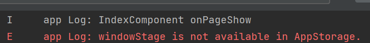

## resource 转 string 类型

#### 报错信息

某些组件的入参并不支持 `Resource` 类型
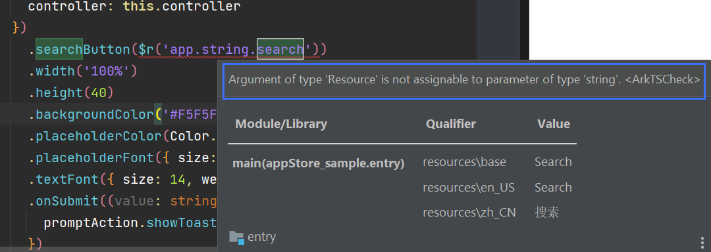

#### 解决办法

##### 第一步

在组件中封装 ResourceToString 方法

```typescript
  ResourceToString(resource:Resource):string{
   return getContext(this).resourceManager.getStringSync(resource)
  }
```

##### 第二步

直接在需要的地方调用

```typescript
Search().searchButton(this.ResourceToString($r("app.string.search")));
```

### 参考文档

**ArkTs 的资源 Resource 类型怎么转为 string:**
https://blog.csdn.net/gsrkuang/article/details/136773584?spm=1001.2101.3001.6650.2&utm_medium=distribute.pc_relevant.none-task-blog-2%7Edefault%7EBlogCommendFromBaidu%7ERate-2-136773584-blog-134664276.235%5Ev43%5Epc_blog_bottom_relevance_base2&depth_1-utm_source=distribute.pc_relevant.none-task-blog-2%7Edefault%7EBlogCommendFromBaidu%7ERate-2-136773584-blog-134664276.235%5Ev43%5Epc_blog_bottom_relevance_base2&utm_relevant_index=5

#### 后续查验

部分功能是 mock 实现，需要真机查验
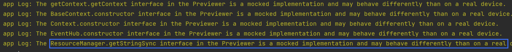

## ArkTS-no-definite-assignment

#### 报错信息

ArkTS 编译的时候有一些警告，例如下面这种变量定义的!语法，会有警告
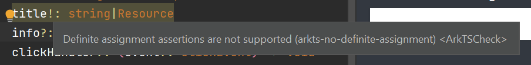

#### 解决办法

官方的解决办法是在定义的时候或者构造函数的时候进行初始化，但是有些对象类型是 Interface 或者 type，这种类型进行初始化推荐用 null 的方式去初始化对象类型，但使用的地方需要判空

对象类型用 null 进行初始化例子：

```typescript
private applicationContext: common.ApplicationContext|null=null;
private uiAbilityContext: common.UIAbilityContext|null=null;
private uiContext: UIContext|null=null;
private windowStage: window.WindowStage|null=null;
```

对于判空的地方太多这个问题，目前没有优化方案，增加判空是为了安全性考虑，如果缺少判空，后续可能会遇到崩溃

告警目前规格是无法配置消除

### 参考文档

**ArkTS 警告处理最佳实践**:
https://segmentfault.com/q/1010000045206935

## main_pages.json 页面必须有唯一入口

#### 报错信息

每个声明在 `model_json.ets` 中的页面必须且唯一有一个入口装饰器  
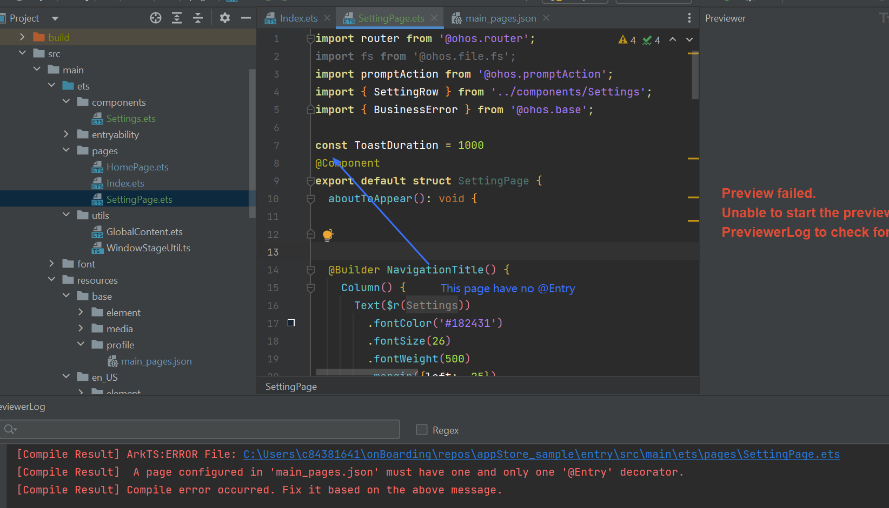

#### 解决办法

##### 步骤一

移除在 `main_json.ets` 文件中不需要的入口的页面

下面的例子中移除掉 `"pages/SettingPage"`

```typescript
{
  "src": [
    "pages/Index",
    "pages/HomePage",
    "pages/SettingPage"
  ]
}
```

##### 步骤二

确保 `SettingPage` 中不存在 `@Entry` 入口装饰器

### 参考文档

https://segmentfault.com/q/1010000045049039

## 语法适配 globalThis 无法使用 abilityContext.filesDir

#### 报错信息

类似于上面 Problem 4, globalThis 无法使用

#### 解决方法

使用 AppStorage 方法的位置不同

##### 步骤一

在 `EntryAbility.ets` 文件中存储 `filesDir`

```typescript
export default class EntryAbility extends UIAbility {
  onCreate(want: Want, launchParam: AbilityConstant.LaunchParam): void {
    hilog.info(0x0000, 'testTag', '%{public}s', 'Ability onCreate');
    let filesDir = this.context.filesDir;
    AppStorage.setOrCreate("filesDir", filesDir);
  }
  ···
}
```

##### 步骤二

在需要的方法中声明 filesDir 变量并将 AppStorage 中的数据存放进去， 然后在需要的地方使用即可

```typescript
  clearCache() {
    // 从 AppStorage 获取 filesDir 数据
    const filesDir = AppStorage.get<string>("filesDir");

    try {
      promptAction.showDialog({
        title: $r('app.string.confirm_clear_cache'),
        message: $r('app.string.clear_cache_warning'),
        buttons: [
          { text: $r('app.string.cancel'), color: '#000000', },
          { text:$r('app.string.confirm'), color: '#3478f6', }
        ],
      }).then(data => {
        console.info('showDialog success, click button: ' + data.index);

        if (data.index == 1) {
          // 下载路径 /data/storage/el2/base/haps/entry/files
          let dirPath = filesDir;
        }
      }
    }
  }
```

## 语法适配 for...in 无法使用

#### 报错信息

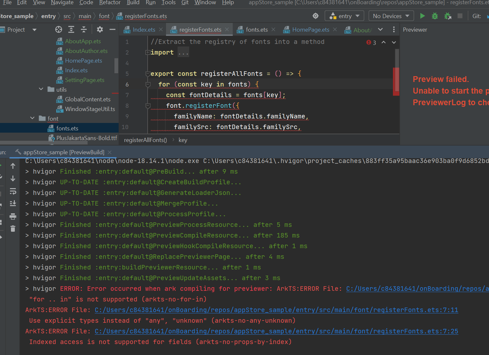

#### 解决 for...in 不兼容方法

由于在 ArkTS 中，对象布局在编译时是确定的、并且不能在运行时被改变，所以不支持使用 for … in 迭代一个对象的属性。对于数组来说，可以使用常规的 for 循环

- Typescript

```typescript
let a: string[] = ["1.0", "2.0", "3.0"];
for (let i in a) {
  console.log(a[i]);
}
```

- ArkTS

```typescript
let a: string[] = ["1.0", "2.0", "3.0"];
for (let i = 0; i < a.length; ++i) {
  console.log(a[i]);
}
```

#### 第一个新的问题(ArkTS 遍历对象数组)

由于项目中定义的 `fonts` 不是数组而是对象，所以不可以 for 循环遍历  
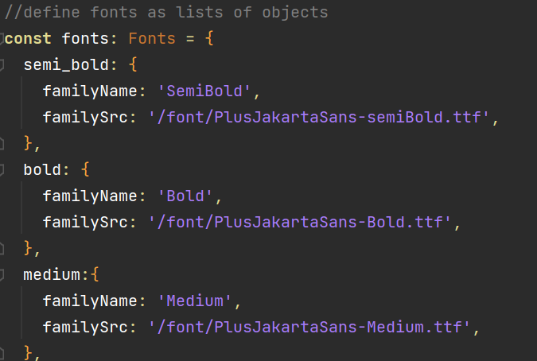

#### 解决方案

要遍历 object 和 Record 这种类型的对象可以使用 `Object.keys()` 方法获取对象的所有属性，并进行遍历

##### 举例

```typescript
const obj = { a: 1, b: 2, c: 3 };

Object.keys(obj).forEach((key) => {
  console.log(key, obj[key]);
});
```

##### 修改前

```typescript
export const registerAllFonts = () => {
  for (const key in fonts) {
    const fontDetails = fonts[key];
    font.registerFont({
      familyName: fontDetails.familyName,
      familySrc: fontDetails.familySrc,
    });
  }
};
```

##### 修改后

```typescript
export const registerAllFonts = () => {
  Object.keys(fonts).forEach((key) => {
    const fontDetails: Font = fonts[key];
    // 注册字体
    font.registerFont({
      familyName: fontDetails.familyName,
      familySrc: fontDetails.familySrc,
    });
  });
};
```

#### 第二个新的问题(Indexed access is not supported for fields)

经过初步代码修改，发现仍然报错， 信息如下  
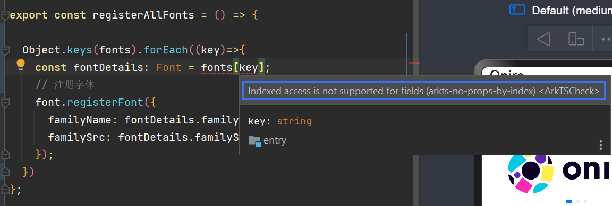

相同的问题在 `AppInfo.ets` 中也出现了

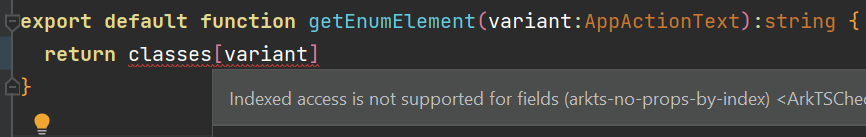

##### 解决方法

可以使用 `Object(item)[key]` 或者 `JSON.parse(JSON.stringify(item))[key]`

##### 最终的代码

采取了 ` Object(item)[key]` 的方式

```typescript
export const registerAllFonts = () => {
  Object.keys(fonts).forEach((key) => {
    const fontDetails: Font = Object(fonts)[key];
    // 注册字体
    font.registerFont({
      familyName: fontDetails.familyName,
      familySrc: fontDetails.familySrc,
    });
  });
};
```

#### 参考文档

ArkTS 不支持 for … in 的适配规则：
https://ost.51cto.com/posts/29738

ArkTS 中如何遍历对象：
https://segmentfault.com/q/1010000044602257

访问对象值的报错问题：
https://blog.csdn.net/qq_54418719/article/details/140772066?spm=1001.2101.3001.6650.2&utm_medium=distribute.pc_relevant.none-task-blog-2%7Edefault%7ECTRLIST%7ECtr-2-140772066-blog-135171005.235%5Ev43%5Epc_blog_bottom_relevance_base2&depth_1-utm_source=distribute.pc_relevant.none-task-blog-2%7Edefault%7ECTRLIST%7ECtr-2-140772066-blog-135171005.235%5Ev43%5Epc_blog_bottom_relevance_base2&utm_relevant_index=5

## Object.assign 报错

#### 报错信息

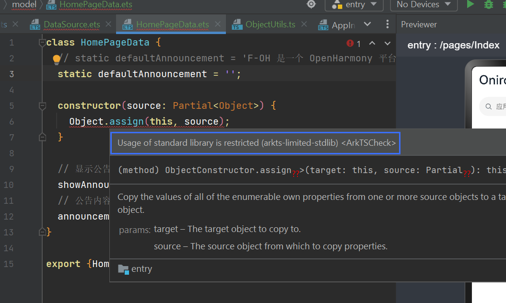

#### 解决方法

在 ts 文件中封装一个工具类，然后在 ets 中引入使用。(把原文件换成 ts 文件，再 ets 中引入)

```typescript
export class ObjectUtils {
  /**
   *对象合并
   *@param target 目标对象
   *@param source 源对象
   *@return 合并后的对象
   **/
  static assign(target: Object, source?: Object): Object {
    return Object.assign(target, source);
  }
}
```

#### 新的问题

引入 ObjectUtils 后出现新的报错
不能把 Partial<Object>类型的变量作为对象类型
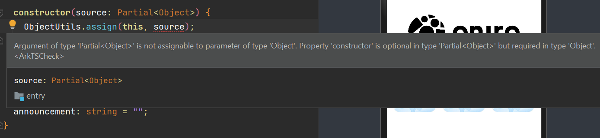

##### 解决方法

使用 `as` 进行强制类型转换

```typescript
import { ObjectUtils } from "../utils/ObjectUtils";

class HomePageData {
  static defaultAnnouncement = "";
  constructor(source: Partial<Object>) {
    ObjectUtils.assign(this, source as Object);
  }
  // 显示公告
  showAnnouncement: boolean = true;
  // 公告内容
  announcement: string = "";
}
export { HomePageData };
```

#### 参考文档

HarmonyOS Object.assign\(target, source\)报错问题：
https://segmentfault.com/q/1010000045208468

Argument of type partial is not assignable to parameter of type:
https://stackoverflow.com/questions/63507831/argument-of-type-partial-is-not-assignable-to-parameter-of-type

## 对象属性名称非标识符报错

#### 报错信息

有两个报错：

- arkts-no-untyped-obj-literals：对象文字必须对应某个显式声明的类或接口
- arkts-identifiers-as-prop-names：对象属性名称必须是标识符，不能是非标识符字符串。

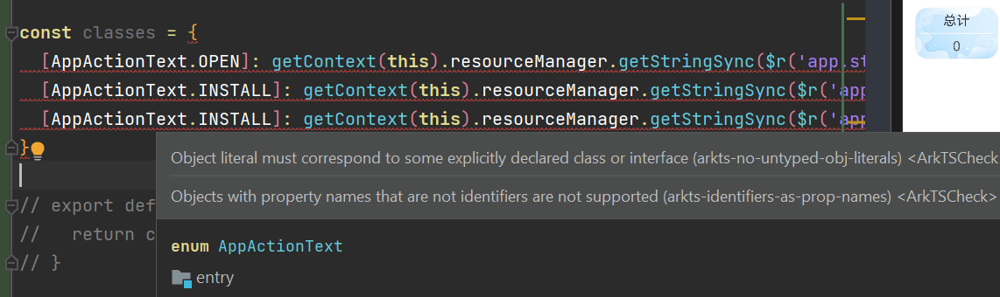

#### 解决方法

ArkTSCheck 中的 `arkts-identifiers-as-prop-names` 规则不允许对象属性名称使用非标识符（如中文字符、空格等）。由于 `AppActionText` 枚举值包含中文字符，直接将它们用作对象的键会触发该规则。

我使用的解决方案是创建一个映射类型，将枚举值转换为标识符友好的英文键

##### 步骤一

定义 `ActionTextMap` 接口，替代对象字面量类型

```typescript
interface ActionTextMap {
  open: AppActionText;
  install: AppActionText;
  update: AppActionText;
}
```

##### 步骤二

使用 `ActionTextMap` 接口声明 `actionTextMap` 对象

```typescript
const actionTextMap: ActionTextMap = {
  open: AppActionText.OPEN,
  install: AppActionText.INSTALL,
  update: AppActionText.UPDATE,
};
```

##### 步骤三

定义 `classes` 对象，使用标识符友好的键名

```typescript
const classes: AppActionClasses = {
  open: getContext(this).resourceManager.getStringSync($r("app.string.open")),
  install: getContext(this).resourceManager.getStringSync(
    $r("app.string.install")
  ),
  update: getContext(this).resourceManager.getStringSync(
    $r("app.string.update")
  ),
};
```

#### 参考文档

https://blog.csdn.net/yuanlaile/article/details/139123015

https://segmentfault.com/a/1190000044588922

## .catch(err)报错

#### 报错信息

arkts-no-any-unknown

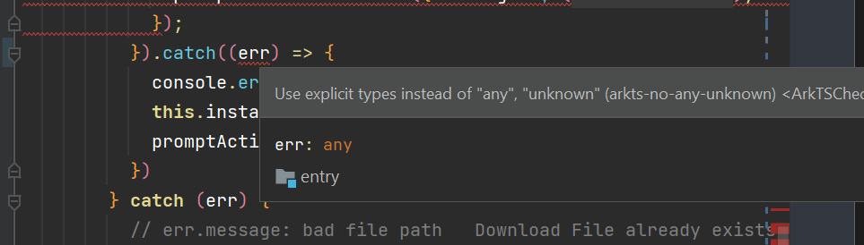

#### 解决方法

存在没有声明具体类型的变量，常见于`try-catch`中的`err`，可以将它声明为`BussinessError`

```typescript
import { BusinessError } from '@ohos.base';

...

, (err: BusinessError) => {
  console.error(`startApplication promise error: ${JSON.stringify(err)}`);
  promptAction.showToast({ message: $r('app.string.open_failed_app_not_found'), duration: ToastDuration });
};
```

#### 参考文档

https://blog.csdn.net/lz8362/article/details/135171005

## router 接收参数报错

#### 报错信息

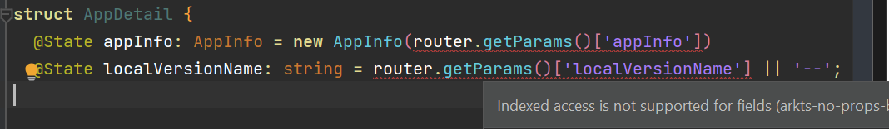
通过路由传入页面的参数列表如下：

```typescript
router.pushUrl({
  url: "pages/AppDetail",
  params: { appInfo: this.appInfo, localVersionName: this.versionCode },
});
```

#### 解决方法

##### 步骤一

自定义接口类型

```typescript
interface RouterParams {
  appInfo?: AppInfo;
  localVersionName?: string;
}
```

##### 步骤二

通过 `as Type` 的方式获取参数

```typescript
const params = router.getParams() as RouterParams;
this.appInfo = new AppInfo(params.appInfo);
this.localVersionName = params.localVersionName;
```

#### 参考文档

https://docs.openharmony.cn/pages/v4.1/zh-cn/application-dev/ui/arkts-routing.md

## Web 组件无法通过参数渲染

#### 情景描述

创建的 `Web` 组件在初始化参数中无法进行动态渲染

```typescript
Web({ src: this.url, controller: this.controller }); //这里的src如果我们传入具体的url字符串则可以渲染网页
```

#### 解决方法

通过控制器的 `loadUrl` 接口将此 Web 组件显示页面变更

```typescript
import webview from "@ohos.web.webview";
//初始化Web控制器
controller: webview.WebviewController = new webview.WebviewController();
```

```typescript
// 在Web组件的onControllerAttached回调函数中调用
Web({ src: this.url, controller: this.controller }).onControllerAttached(() => {
  this.controller.loadUrl(this.url);
});
```

#### 参考文档

https://docs.openharmony.cn/pages/v4.1/zh-cn/application-dev/web/web-page-loading-with-web-components.md

## 服务器数据无法渲染


## 网页加载过程中需要缓冲组件和连接失败页面

### 缓冲组件

- 定义状态变量 `isLoading`
```typescript
  @State isLoading: boolean = false
```
- 条件判断`isLoading`状态是否渲染缓冲动画 
```typescript
  if (this.isLoading) {
    Column() {
      LoadingProgress()
        .color(Color.Blue)
        .width(50)
        .margin({ bottom: '10%' })
    }
    .height('100%')
    .justifyContent(FlexAlign.Center)
  }
```
- 在页面出现之前渲染缓冲动画
```typescript
  //执行其build()函数之前执行
  aboutToAppear() {
    this.isLoading = true
  }
```
- 在Web组件开始渲染的时候隐藏缓冲动画
```typescript
Web({ src: this.url, controller: this.controller })
  .onPageBegin((event) => {
    this.isLoading = false
  })
```
### 连接失败页面
- 定义状态变量 `isHttpError`
```typescript
@State isHttpError: boolean = false
```
- 定义无网络组件

```typescript
if (this.isHttpError) {
  Column() {
    Column(){

    Image($r('app.media.ic_no_wifi'))
      .width('20%')
      .opacity(0.4)
    Text("Seems you don't have Internet")
      .opacity(0.4)
      .margin(5)
    Button('Reload')
      .fontColor(Color.Black)
      .backgroundColor(Color.Orange)
      .height('5%')
      .width('35%')
      .type(ButtonType.Normal)
      .fontSize(14)
      .borderRadius(5)
      .fontWeight(FontWeight.Medium)
      .opacity(0.6)
      .onClick(() => {
        // todo: Get code
      })
      .margin(10)
    }
    .margin({
      bottom: '10%'
    })
  }
  .height('100%')
  .justifyContent(FlexAlign.Center)
}
```

- 在Web组件`onErrorReceive`属性中控制状态变量
```typescript
.onErrorReceive((event)=>{
  if(event){
    this.isHttpError = true
  }
})
```
#### 参考文档
LoadingProgress:  
https://blog.csdn.net/qq_58213084/article/details/138597035
onErrorReceive:  
https://docs.openharmony.cn/pages/v5.0/zh-cn/application-dev/reference/apis-arkweb/ts-basic-components-web.md


## 下拉实现刷新

#### 注意
刷新功能如果有个按钮，必须在onclick回调函数中调用`this.controller.refresh()`和`this.controller.pushUrl()`

#### 出现问题
Refresh组件可以实现下拉刷新但是如果里面的唯一组件是Web则失败

#### 问题解答
`Web` 组件无法下拉刷新的问题通常与组件的原生行为和框架支持有关。
因为 `Web` 组件本身是一个独立的视图，不支持与 `Refresh` 组件的交互式刷新行为，而嵌入式浏览器视图在默认情况下不会响应诸如手势或父级容器的下拉刷新。

#### 替代方案
采用 `Button` 组件手动点击触发刷新事件
```typescript
Stack() {
  // 页面标题
  Navigation()
    .title(this.NavigationTitle())
    .hideToolBar(true)
    .height(56)
    .width('100%')
    .titleMode(NavigationTitleMode.Mini)
    .hideBackButton(false)

  Button() {
    Image($r('app.media.ic_refresh'))
      .height(30)
      .width(30)
  }
  .zIndex(1)
  .fontColor(Color.Black)
  .backgroundColor(Color.White)
  .height('5%')
  .type(ButtonType.Circle)
  .fontWeight(FontWeight.Medium)
  .opacity(0.8)
  .margin({
    right: 15
  })
  .onClick(() => {
    try {
      this.isLoading = true
      this.controller.refresh();
      this.controller.loadUrl(this.url)
    } catch (error) {
      hilog.error(0x0, `ErrorCode: ${(error as BusinessError).code}`, `Message: ${(error as BusinessError).message}`);
    }
  })
}
.alignContent(Alignment.End)
```

#### 参考文档
https://docs.openharmony.cn/pages/v5.0/zh-cn/application-dev/reference/apis-arkweb/js-apis-webview.md#refresh