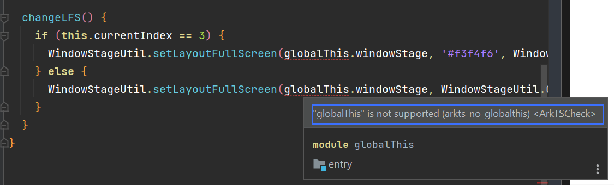

# AppStore API 11 (回家准备 Scroll() Navigation() Tabs())

本文档展示了在构造基于 API9 Oniro 应用商城时遇到的问题

本文档使用 Deveco Studio 4.1 API version 11

1. [fonts 报错](#fonts报错)
2. [语法适配 globalThis 无法使用](#语法适配-globalthis-无法使用)

## fonts 报错

```
> hvigor ERROR: Error occurred when ark compiling for previewer: ArkTS:ERROR File: C:/Users/c84381641/DevEcoStudioProjects/appStore_sample/entry/src/main/font/fonts.ets:4:15
 Object literal must correspond to some explicitly declared class or interface (arkts-no-untyped-obj-literals)
```

#### 报错分析

在`fonts.ets`文件中， 使用了未明确声明类型的对象字面变量(object literal)

ArkTS 要求所有对象字面量都必须与某个显式声明的类或接口对应，以确保**类型安全**

```typescript
//define fonts as lists of objects
const fonts = {
  semi_bold: {
    familyName: "SemiBold",
    familySrc: "/font/PlusJakartaSans-semiBold.ttf",
  },
  bold: {
    familyName: "Bold",
    familySrc: "/font/PlusJakartaSans-Bold.ttf",
  },
  medium: {
    familyName: "Medium",
    familySrc: "/font/PlusJakartaSans-Medium.ttf",
  },
  light: {
    familyName: "Light",
    familySrc: "/font/PlusJakartaSans-Light.ttf",
  },
  regular: {
    familyName: "Regular",
    familySrc: "/font/PlusJakartaSans-Regular.ttf",
  },
  extraBold: {
    familyName: "ExtraBold",
    familySrc: "/font/PlusJakartaSans-ExtraBold.ttf",
  },
  italic: {
    familyName: "Italic",
    familySrc: "/font/PlusJakartaSans-Italic.ttf",
  },
};

export default fonts;
```

#### 解决方法

为 `fonts` 对象字面量创建一个显式的接口

```typescript
// 定义 Font 接口
interface Font {
  familyName: string;
  familySrc: string;
}

// 定义具体的 Fonts 对象类型
interface Fonts {
  semi_bold: Font;
  bold: Font;
  medium: Font;
  light: Font;
  regular: Font;
  extraBold: Font;
  italic: Font;
}

// 定义 fonts 对象
const fonts: Fonts = {
  semi_bold: {
    familyName: "SemiBold",
    familySrc: "/font/PlusJakartaSans-semiBold.ttf",
  },
  bold: {
    familyName: "Bold",
    familySrc: "/font/PlusJakartaSans-Bold.ttf",
  },
  medium: {
    familyName: "Medium",
    familySrc: "/font/PlusJakartaSans-Medium.ttf",
  },
  light: {
    familyName: "Light",
    familySrc: "/font/PlusJakartaSans-Light.ttf",
  },
  regular: {
    familyName: "Regular",
    familySrc: "/font/PlusJakartaSans-Regular.ttf",
  },
  extraBold: {
    familyName: "ExtraBold",
    familySrc: "/font/PlusJakartaSans-ExtraBold.ttf",
  },
  italic: {
    familyName: "Italic",
    familySrc: "/font/PlusJakartaSans-Italic.ttf",
  },
};

export default fonts;
```

> **Note** 在 ArkTS 中，不支持使用索引签名（indexed signatures）
> 因此，不能使用像 [key: string]: Font(下面例子) 这样的语法来定义一个对象类型

```typescript
// 定义 Fonts 对象的接口
interface Fonts {
  [key: string]: Font; // 允许有任意数量的字体，键为字符串，值为 Font 类型
}
```

> 为了避免使用索引签名，可以为每种字体显式定义其类型

```typescript
// 定义具体的 Fonts 对象类型
interface Fonts {
  semi_bold: Font;
  bold: Font;
  medium: Font;
  light: Font;
  regular: Font;
  extraBold: Font;
  italic: Font;
}
```

## 语法适配 globalThis 无法使用



#### 参考文档

https://forums.openharmony.cn/forum.php?mod=viewthread&tid=1601

由于无法为 globalThis 添加静态类型，只能通过查找的方式访问 globalThis 的属性，造成额外的性能开销。另外，无法为 globalThis 的属性标记类型，无法保证对这些属性操作的安全和高性能。因此 ArkTS 不支持 globalThis。

建议按照业务逻辑根据 import/export 语法实现数据在不同模块的传递。

必要情况下，可以通过构造的单例对象来实现全局对象的功能。(**说明：**不能在 har 中定义单例对象，har 在打包时会在不同的 hap 中打包两份，无法实现单例。)

#### 解决方法

组件内声明 windowStage 然后通过 this 指针调用

```typescript
windowStage?: window.WindowStage;
```

```typescript
  changeLFS() {
    if (this.currentIndex == 3) {
      WindowStageUtil.setLayoutFullScreen(this.windowStage, '#f3f4f6', WindowStageUtil.COLOR_BLACK, '#f7f7f7', WindowStageUtil.COLOR_BLACK);
    } else {
      WindowStageUtil.setLayoutFullScreen(this.windowStage, WindowStageUtil.COLOR_WHITE, WindowStageUtil.COLOR_BLACK, '#f7f7f7', WindowStageUtil.COLOR_BLACK);
    }
  }
```
