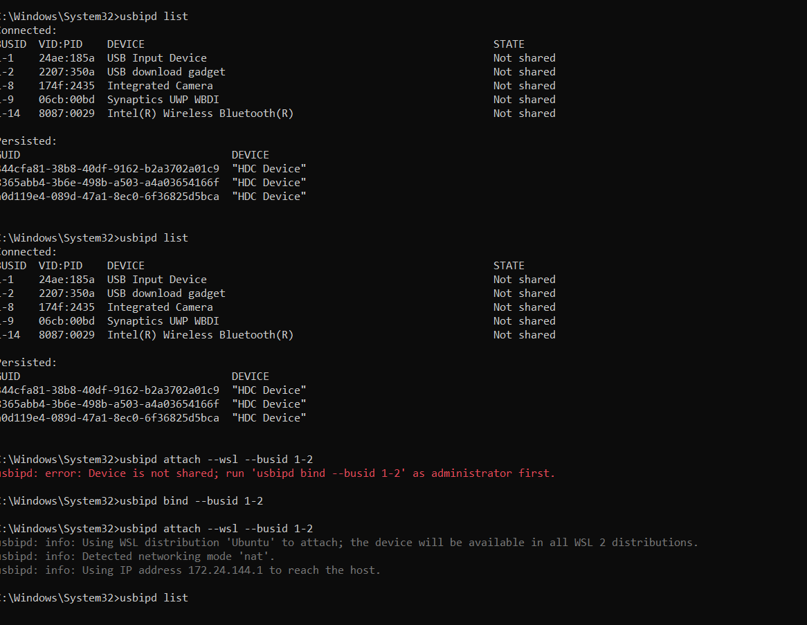

This docs introduces how to update oniro developer board to the newest OpenHarmony version

#### Environment
First of all, the environment needs to be on Linux(For me is Ubuntu system)

Step 1:  
we can download the images for the board or you can build it yourself(I downloaded the image dayu200_standard_arm32.tar.gz from my colleague's link)
Didn't try the way of building by myself.

Step 2:
Flash the board following the `oniro docs` :  
 https://docs.oniroproject.org/developer-boards/hihope-hh-scdayu200.html#flashing


- Connect the board with Power pin(DCIN-12V) and USB-A pin(USB3.0 HOST1)

- Download the flash.py flashing tool from Gitee using the following commands:

```bash
git clone https://gitee.com/hihope_iot/docs.git hihope_iot_docs
mkdir flash && cp -r hihope_iot_docs/HiHope_DAYU200/烧写工具及指南/linux/* flash/
chmod +x flash/flash.py flash/bin/flash.x86_64
```
- To ensure proper device recognition, install the udev rule:

```bash
sudo cp flash/etc/udev/rules.d/85-rk3568.rules /etc/udev/rules.d/85-rk3568.rules
```

- Then, either reload udev rules or reboot your system:(没有权限就sudo)
```bash
udevadm control --reload-rules
```
- After this setup, running `flash/flash.py -q` should produce the following output, indicating readiness:(检查输出)

>Note:
If you want to implement it through WSL, you need to attach USB devices to virtual Ubuntu, and follow the procedure with the link instruction from `Attach a USB device`:
https://learn.microsoft.com/en-us/windows/wsl/connect-usb


```bash
# some useful command on wsl
$ dmesg | tail -n 50 # output log

 lsusb # check port sitatuation

```


```bash
maskrom
```
- To enable programming mode on the device, perform the following steps:
    - Press and hold VOL/RECOVERY then RESET buttons.
    - Release RESET button.

(先按住 VOL/RECOVERY 再按 RESET 按钮都不松开，然后松开 RESET 按钮)

如果是在windows里面运行wsl这时候这个port会跑到另一个地方，找到名字叫做“USB download gadget”的busid， 然后重新attach到wsl，这时候在wsl中可以观测到loader mode了

- Confirm the mode by running lsusb, which should show:
```
loader
```

- Once the above steps are completed successfully, you can proceed to flash the board:

```bash
flash/flash.py -a -i ./out/rk3568/packages/phone/images
```

`注意：` ./out/rk3568/packages/phone/images 路径里面必须是我们之前下载的镜像文件的路径 `dayu200_standard_arm32.tar.gz`，否则手动更改镜像路径

#### Reference material  
https://docs.oniroproject.org/developer-boards/hihope-hh-scdayu200.html#building

## Flashing Procedures

To begin, connect the board to your computer as outlined in [the HiHope DAYU200 documentation](https://gitee.com/hihope_iot/docs/blob/master/HiHope_DAYU200/docs/%E7%83%A7%E5%BD%95%E6%8C%87%E5%AF%BC%E6%96%87%E6%A1%A3.md). Use the USB-C and mini-USB cables included in the kit to connect to the USB 3.0 OTG port and the mini-USB DEBUG port, respectively.

We have different steps for a standalone Linux system and for Windows systems with built-in WSL.

- [Standalone Linux System](#in-standalone-linux-system)  
- [Windows System with built-in WSL](#windows-system-with-built-in-wsl)  

### In Standalone Linux System

Power on the device by attaching the power cable. Upon successful connection, your serial console should display output similar to:

```bash
Bus 002 Device 009: ID 2207:5000 Fuzhou Rockchip Electronics Company "HDC Device"
...
Bus 001 Device 069: ID 0403:6001 Future Technology Devices International, Ltd FT232 Serial (UART) IC
```

Download the `flash.py` flashing tool from [Gitee](https://gitee.com/hihope_iot/docs/tree/master/HiHope_DAYU200/%E7%83%A7%E5%86%99%E5%B7%A5%E5%85%B7%E5%8F%8A%E6%8C%87%E5%8D%97/linux) using the following commands:

```bash
git clone https://gitee.com/hihope_iot/docs.git hihope_iot_docs
mkdir flash && cp -r hihope_iot_docs/HiHope_DAYU200/烧写工具及指南/linux/* flash/
chmod +x flash/flash.py flash/bin/flash.x86_64
```

To ensure proper device recognition, install the `udev` rule:

```bash
sudo cp flash/etc/udev/rules.d/85-rk3568.rules /etc/udev/rules.d/85-rk3568.rules
```
Then, either reload udev rules or reboot your system:

```bash
sudo udevadm control --reload-rules
```

After this setup, running `flash/flash.py -q` should produce the following output, indicating readiness:

```bash
maskrom
```

To enable *programming mode* on the device, perform the following steps:

 1. Press and hold `VOL/RECOVERY` then `RESET` buttons.
 2. Release `RESET` button.

Confirm the mode by running `lsusb`, which should show:

```bash
...
Bus 001 Device 070: ID 2207:350a Fuzhou Rockchip Electronics Company USB download gadget
...

$ flash/flash.py -q
loader
```

Once the above steps are completed successfully, you can proceed to flash the board:

```bash
flash/flash.py -a -i ./out/rk3568/packages/phone/images
```

### Connecting to serial console

To read the serial output, ensure the board is correctly connected and powered on. The default baud rate for the HH-SCDAYU200 board is 1500000. You can use minicom or a similar serial terminal:

```bash
minicom -D /dev/ttyUSB0 -b 1500000
```

## Windows System with built-in WSL
Power on the device by attaching the power cable. Upon successful connection, type `lsusb` on **WSL** your serial console will display output similar to:

```bash
Bus 001 Device 001: ID 1d6b:0002 Linux Foundation 2.0 root hub
Bus 002 Device 001: ID 1d6b:0003 Linux Foundation 3.0 root hub
```
It's not connected yet, but don't worry.

Download the `flash.py` flashing tool from [Gitee](https://gitee.com/hihope_iot/docs/tree/master/HiHope_DAYU200/%E7%83%A7%E5%86%99%E5%B7%A5%E5%85%B7%E5%8F%8A%E6%8C%87%E5%8D%97/linux) using the following commands on your **WSL**:

```bash
git clone https://gitee.com/hihope_iot/docs.git hihope_iot_docs
mkdir flash && cp -r hihope_iot_docs/HiHope_DAYU200/烧写工具及指南/linux/* flash/
chmod +x flash/flash.py flash/bin/flash.x86_64
```

To ensure proper device recognition, install the `udev` rule:

```bash
sudo cp flash/etc/udev/rules.d/85-rk3568.rules /etc/udev/rules.d/85-rk3568.rules
```
Then, either reload udev rules or reboot your system:

```bash
sudo udevadm control --reload-rules
```

Then, we need to attach USB devices from Windows using **Windows PowerShell** to virtual Linux environment.
Type `usbipd list` with output the following result, find **busid** for which device named "HDC Device".

```bash
Connected:
BUSID  VID:PID    DEVICE                                                        STATE
1-2    24ae:185a  USB Input Device                                              Not shared
1-8    174f:2435  Integrated Camera                                             Not shared
1-9    06cb:00bd  Synaptics UWP WBDI                                            Not shared
1-14   8087:0029  Intel(R) Wireless Bluetooth(R)                                Not shared
1-17   2207:5000  "HDC Device"                                                  Shared
```

In our case, we need take **busid** `1-17`.
>**Note**
>
>If the status of **HDC Device** is **Not shared**, type `usbpid bind --busid 1-17`, in above case the device **busid** is 1-17, change it to adjust your case if necessary.
>
>After re-running command `usbipd list`, you will find the device status changed into `Shared`.

Then we need to attach the device to wsl using command `usbipd attach --wsl --busid 1-17`, the output should be like the following, wait until attach process finishes:

```bash
usbipd: info: Using WSL distribution 'Ubuntu' to attach; the device will be available in all WSL 2 distributions.
usbipd: info: Detected networking mode 'nat'.
usbipd: info: Using IP address 172.24.144.1 to reach the host.
```

>**Note**
>
> If you are not sure about if the device had been attached already, detach it first using command `usbipd detach --busid 1-17`


After this setup, running `flash/flash.py -q` should produce the following output, indicating readiness:

```bash
maskrom
```

>**Note**
>
> If the output is `none`, try to re-run **detach** and **attach** procedures above, you can also check your device connection details using `dmesg | tail -n 50` command on **WSL**.
>
> If still not working, try to change a cable, switch to connect another port on your PC or keep your board screen unlocked.


To enable *programming mode* on the device, perform the following steps:

 1. Press and hold `VOL/RECOVERY` then `RESET` buttons.
 2. Release `RESET` button.

When your run `flash/flash.py -q` again, you will find the output is `none` again. 

Open **Windows PowerShell** again and type `usbipd list`, the output will be like the following:
```bash
Connected:
BUSID  VID:PID    DEVICE                                                        STATE
1-1    24ae:185a  USB Input Device                                              Not shared
1-2    2207:350a  USB download gadget                                           Not shared
1-8    174f:2435  Integrated Camera                                             Not shared
1-9    06cb:00bd  Synaptics UWP WBDI                                            Not shared
1-14   8087:0029  Intel(R) Wireless Bluetooth(R)                                Not shared
```

Find the **busid** for device which named 'USB download gadget', in our case it is `1-2`.
Bind it first `usbipd bind --busid 1-2`, it requires to run the `Windows PowerShell` as administrator.

Then attach it to **WSL**, run `usbipd attach --wsl --busid 1-2`.

After that, switch to **WSL** and run `flash/flash.py -q` again you will find the output is `loader`, which means the device is under development mode now.

Once the above steps are completed successfully, you can proceed to flash the board:

```bash
flash/flash.py -a -i ./out/rk3568/packages/phone/images
```

### Connecting to serial console

To read the serial output, ensure the board is correctly connected and powered on. The default baud rate for the HH-SCDAYU200 board is 1500000. You can use minicom or a similar serial terminal:

```bash
minicom -D /dev/ttyUSB0 -b 1500000
```

## Reference
The original specification and some hardware description comes form the original
(Chinese) HiHope documentation published on [Gitee](https://gitee.com/hihope_iot/docs/tree/master/HiHope_DAYU200).

More details and purchase options can be found at the manufactures [product page](http://www.hihope.org/pro/pro1.aspx?mtt=54).
