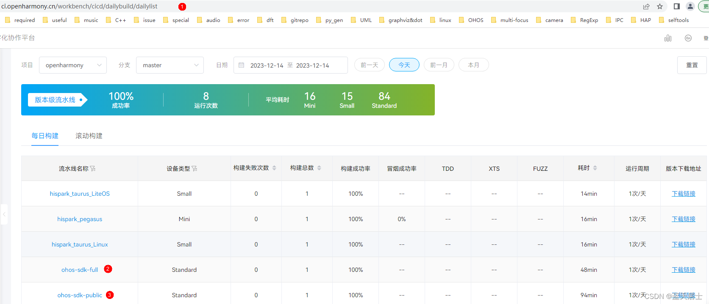
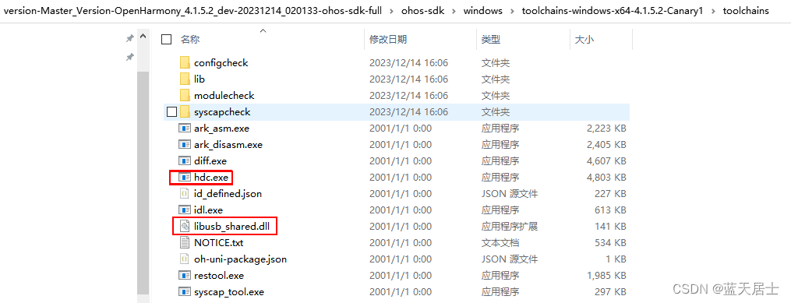
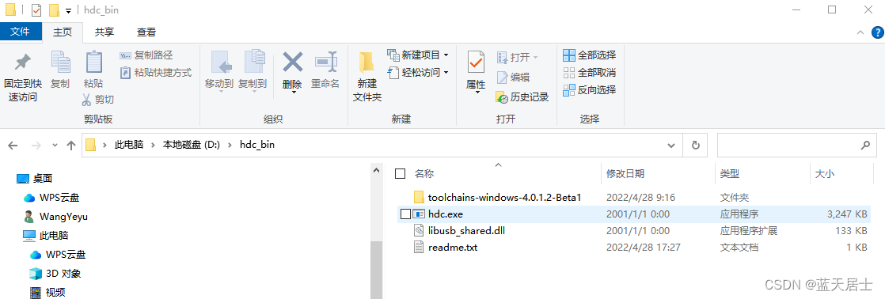
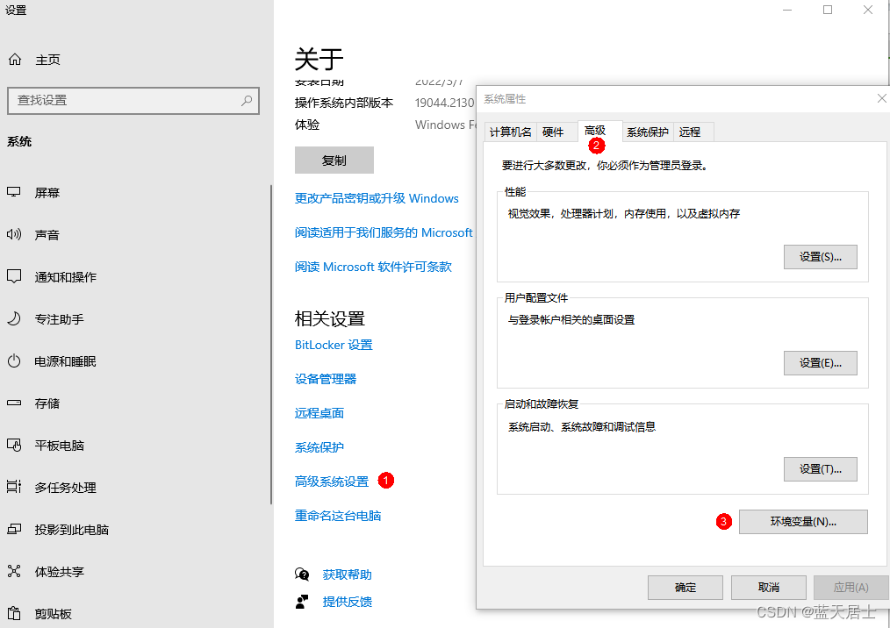
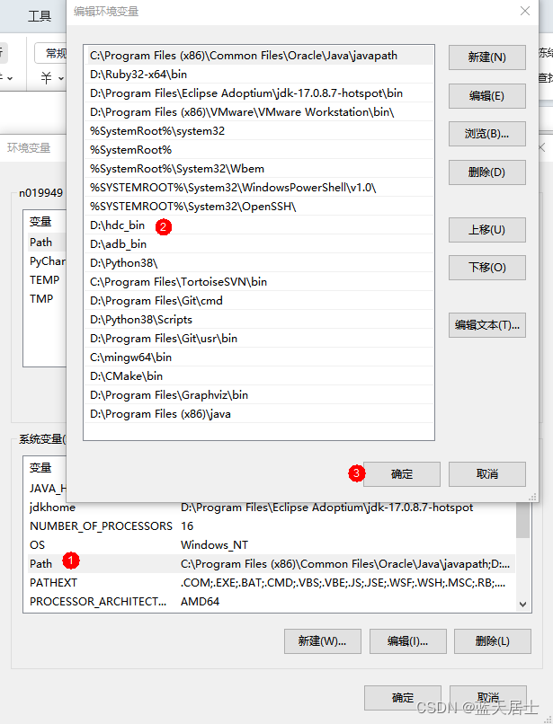
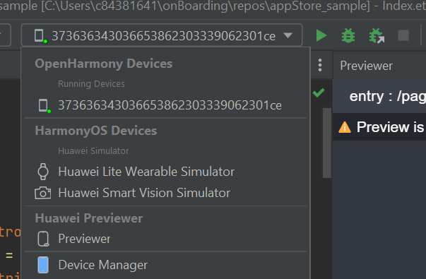
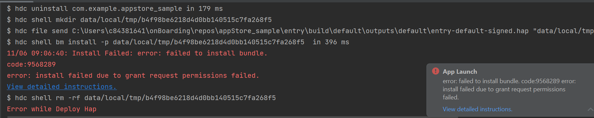

# Real Device Installation

本文档基于构建的应用商城项目展示如何将项目运行在真机上

1. [安装HDC](#安装HDC)
2. [使用本地真机运行应用/服务](#使用本地真机运行应用服务)
3. [使用USB连接方式](#使用USB连接方式)
## 安装HDC
### 第一步
下载安装包
链接：http://ci.openharmony.cn/workbench/cicd/dailybuild/dailylist 

查找“流水线名称”名称为 ohos-sdk-full, 或者 ohos-sdk-public，点击‘下载链接’，选择‘全量包’

### 第二步
解压后找到 `toolchain` 文件夹下选择红框中的文件

### 第三步
拷贝至D:\hdc_bin\目录下

### 第四步
添加环境变量

### 第五步
至此，查看hdc是否可以正常运行

## 使用本地真机运行应用/服务

## 使用USB连接方式
1. 使用USB方式，将Phone或Tablet与PC端进行连接。
2. 在**设置 > 系统 > 开发者选项**中，打开 'USB调试' 开关（确保设备已连接USB）。
3. 在Phone或Tablet中会弹出“允许USB调试”的弹框，单击**允许**
4. 在菜单栏中，单击Run>Run'模块名称'或，或使用默认快捷键Shift+F10（macOS为Control+R）运行应用/服务。

5. DevEco Studio**启动HAP的编译构建和安装**。安装成功后，设备会自动运行安装的HarmonyOS应用/服务。

> **Note:**
设备连接后，如果DevEco Studio无法识别到设备，显示“No device”，请参考 (设备连接后，无法识别设备的处理指导) 

### 出现问题
#### 问题现象
调试运行 > 安装HAP时提示“code:9568289 error: install failed due to grant request permissions failed”

#### 解决方案
该问题是由于默认应用等级为`normal`，只能使用`normal`等级的权限，如果使用了`system_basic`或`system_core`等级的权限，将导致报错。

对于HarmonyOS应用，请参考[使用ACL签名配置指导](https://developer.huawei.com/consumer/cn/doc/harmonyos-guides-V2/signing-0000001587684945-V2#section157591551175916  
)完成ACL提权
对于OpenHarmony应用，请参考[修改应用权限等级](https://developer.huawei.com/consumer/cn/doc/harmonyos-guides-V3/ohos-auto-configuring-signature-information-0000001271659465-V3#section42735161005)修改签名模板

#### 参考文档

hdc安装应用指南：
https://blog.csdn.net/phmatthaus/article/details/135360935

使用本地真机运行应用/服务:
https://developer.huawei.com/consumer/cn/doc/harmonyos-guides-V5/ide-run-device-V5

DevEco使用本地真机运行应用/服务(无线调试):
https://blog.csdn.net/2301_77659368/article/details/141661383#:~:text=%E7%82%B9%E5%87%BB%22%E8%AE%BE%E7%BD%AE%22%20-%3E%20%22%E7%B3%BB%E7%BB%9F%22-%3E%22%E5%BC%80%E5%8F%91%E8%80%85%E9%80%89%E9%A1%B9%22-%3E%22%E6%97%A0%E7%BA%BF%E8%B0%83%E8%AF%95%22,%E5%8D%B3%E5%8F%AF%E7%9C%8B%E5%88%B0%E5%AF%B9%E5%BA%94%20%E8%AE%BE%E5%A4%87%E5%90%8D%E7%A7%B0%EF%BC%8C%20IP%E5%9C%B0%E5%9D%80%E5%92%8C%E7%AB%AF%E5%8F%A3%EF%BC%8C%E6%89%93%E5%BC%80%E6%97%A0%E7%BA%BF%E8%B0%83%E8%AF%95%E6%8C%89%E9%92%AE%E5%8D%B3%E5%8F%AF

安装HAP时提示“code:9568289 error: install failed due to grant request permissions failed”：
https://developer.huawei.com/consumer/cn/doc/harmonyos-faqs-V5/faqs-app-debugging-10-V5

