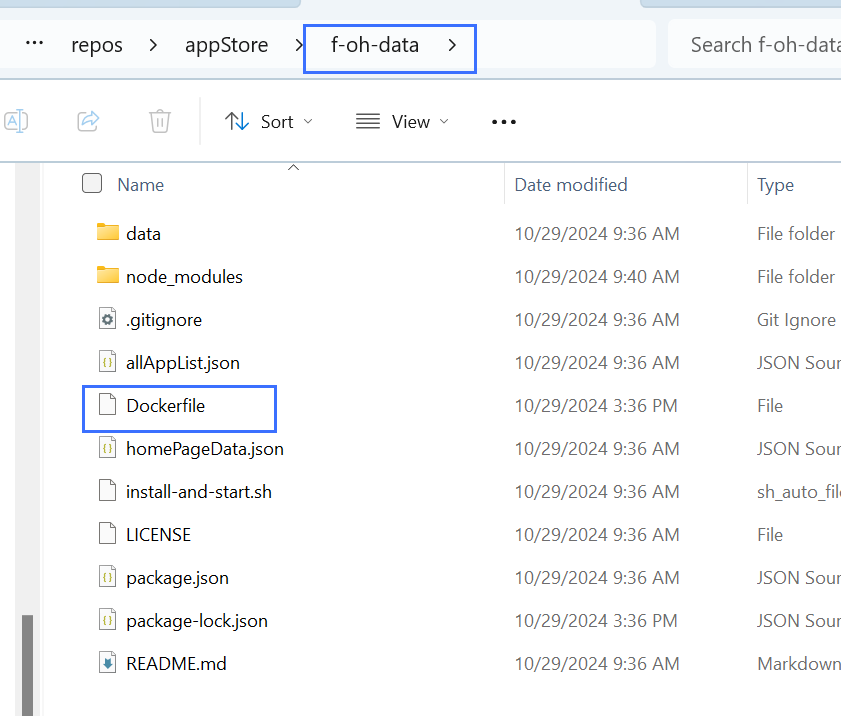
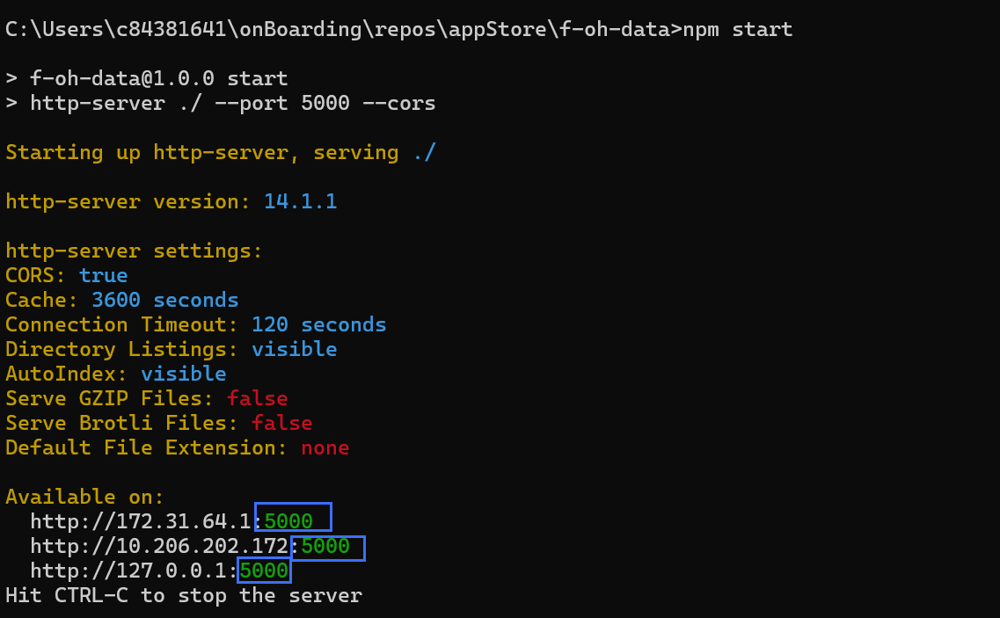
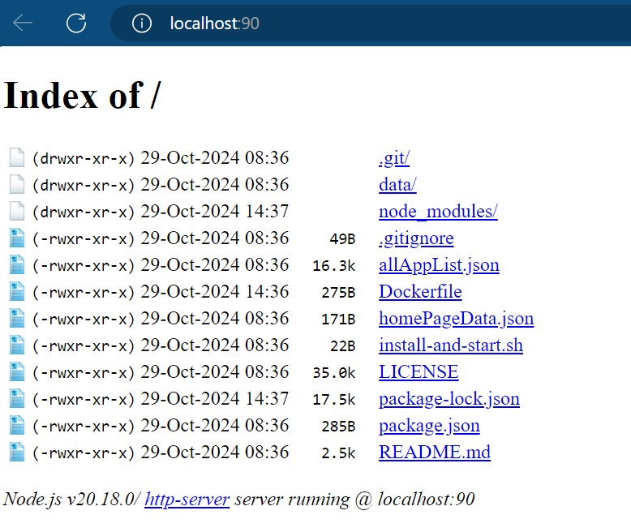

# Table of content
**Guys, if you are watching this doc please wait since the remote server of the appStore data still have something left to do.**


[Deploy project on Docker](#deploy-project-on-docker)  
[Common Docker command](#common-docker-command)  
[Deploy app demo on applist via Docker local server](#deploy-app-demo-on-applist-via-docker-local-server)  
## Deploy project on Docker
#### 本文档教学如何将本地服务器部署到云服务器Docker上

## 第一步： 将远程库的项目克隆到本地
以Oniro应用商城为例
```typescript
git clone https://gitee.com/westinyang/f-oh-data
```
## 第二步： 在项目文件目录下编写Dockerfile文档
<div>
  
</div>

```typescript
# Choose an appropriate base image
FROM node:20-alpine

# Set Environment
WORKDIR /app

# Install Dependencies
COPY package*.json ./
COPY . /app

RUN npm install
RUN npm install -g serve

# Expose Ports
EXPOSE 8080

# Set Start Command
CMD ["npm", "start"]

```

## 第三步：在命令行中运行命令创建Docker的Image文件

```typescript
docker build -t f-oh-data .
```

## 第四步： 在服务器上部署容器container
```typescript
docker run -d -p 80:8080 f-oh-data
```

<div>
  
</div>

> **Note**: 
> 本地port number 80 如果被占用可以选择其他的port，端口号需要先在本地运行看一下具体在哪儿端口，然后输入相同
> 的端口号

## 运行云端服务器
在本地输入对应的URL即可

<div>
  
</div>

## Deploy app demo on applist via Docker local server

This route introduces the process of app deploy on applist.  
We will study the information based on trial from the history.
```typescript
    1  ls -lah
    2  cd /home/chen
    3  ls -lah
    4  sudo chown chen:chen .ssh
    5  exit
    6  dir
    7  cd f-oh-data/
    8  dir
    9  cd Dockerfile
   10  passwd sc1319351173
   11  passwd
   12  docker run -d -p 5000:5000 gowokegobroke/oniro-data:latest
   13  cls
   14  clear
   15  docker ps
   16  ls
   17  f-oh-data/
   18  cd f-oh-data/
   19  ls
   20  docker build
   21  docker build -t f-oh-data .
   22  docker image ls
   23  docker ps
   24  docker stop 130b3773b2e8
   25  docker run -d -p 80:5000 f-oh-data
   26  docker ps
   27  curl http://localhost:5000
   28  docker ps
   29  cat Dockerfile
   30  docker ps
   31  docker rm -f eaa04f63d6bd
   32  docker ps
   33  docker run -d -p 5000:5000 f-oh-data
   34  docker ps
   35  curl http://localhost:5000
   36  cat Dockerfile
   37  vi Dockerfile
   38  docker build -t f-oh-data .
   39  docker ps
   40  docker rm -f 38e84fd5ecab
   41  docker run -d -p 5000:5000 f-oh-data
   42  curl http://localhost:5000
   43  docker ps
   44  docker rm -f 86c73a827819
   45  docker run -d -p 5000:5000 gowokegobroke/oniro-data:latest
   46  docker ps
   47  docker exec -it 70cb78e186c8
   48  docker exec -it 70cb78e186c8 bash
   49  docker copy 70cb78e186c8:/usr/src/app/allAppList.json .
   50  docker cp 70cb78e186c8:/usr/src/app/allAppList.json .
   51  ls -lah
   52  cat allAppList.json
   53  docker ps
   54  docker cp allAppList.json 70cb78e186c8:/usr/src/app/allAppList.json
   55  docker stop 70cb78e186c8
   56  docker ps
   57  docker build -t f-oh-data .
   58  docker run -d -p 5000:5000 f-oh-data
   59  docker ps
   60  docker cp allAppList.json 7066bb3cd0ad:/usr/src/app/allAppList.json
   61  docker exec -it 7066bb3cd0ad bash
   62  docker cp allAppList.json 7066bb3cd0ad:/app/allAppList.json
   63  docker restart 7066bb3cd0ad
   64  ls
   65  docker run
   66  docker ps
   67  docker stop 7066bb3cd0ad
   68  docker container ls
   69  docker image
   70  docker image ls
   71  docker run -d -p 5000:5000 gowokegobroke/oniro-data:latest
   72  curl http://localhost:5000
   73  ip a
   74  docker ps
   75  exit
   76  history
   77  ls
   78  cd f-oh-data/
   79  ls
   80  cat Dockerfile
   81  ls
   82  vi Dockerfile
   83  docker build -t f-oh-data .
   84  ls -lah
   85  docker ps
   86  docker stop compassionate_cray
   87  docker run -d -p 5000:5000 f-oh-data
   88  docker ps
   89  cat Dockerfile
   90  exit
   91  history
```

**基本 Docker 操作**
```typescript
docker ps
//列出当前正在运行的容器。可以查看容器的状态、容器 ID、映射的端口等信息。

docker image ls
//显示当前本地 Docker 主机上存储的镜像列表，包括镜像名称、标签、大小和镜像 ID。

docker build -t <name> 
//从当前目录的 Dockerfile 构建镜像，-t <name> 为构建的镜像指定名称和标签。

docker run -d -p <host_port>:<container_port> <image>
// 启动一个容器：
// -d 表示后台运行（detached 模式）。
// -p 将宿主机的端口绑定到容器的端口。

docker stop <container>
// 停止指定容器，<container> 可以是容器的 ID 或名称。

docker rm -f <container>
// 强制删除容器。

docker exec -it <container> <command>
// 在运行中的容器内执行命令，-it 允许交互式操作，例如运行一个 bash

docker cp <source> <container>:<destination> 和 docker cp <container>:<source> <destination>
// 将文件从宿主机拷贝到容器或从容器拷贝到宿主机。

docker restart <container>
// 重启指定的容器

docker container ls
// 列出运行中的容器，相当于 docker ps。
```

**复杂操作解释**
```typescript
docker build -t f-oh-data .
// 从当前目录的 Dockerfile 构建了一个名为 f-oh-data 的镜像。这里的 . 指当前目录。
// 每次你修改了 Dockerfile 后都需要重新运行此命令，生成新的镜像。

docker run -d -p 5000:5000 f-oh-data
// 启动了 f-oh-data 容器，并将宿主机的 5000 端口映射到容器的 5000 端口。
// 使用 docker exec -it <container_id> bash 进入运行中的容器进行调试。
```

```typescript
{
    "id": 29,
    "name": "数学通",
    "desc": "助你高效提升数学成绩的学习助手",
    "icon": "/data/com.example.oniromathpunching/icon.png",
    "vender": "Chen",
    "packageName": "com.example.oniromathpunching",
    "version": "1.0.0",
    "hapUrl": "/data/com.example.oniromathpunching/oniromathpunching-v1.0.0.hap",
    "type": "app",
    "tags": "实用工具，数学练习",
    "openSourceAddress": "https://github.com/imansmallapple/app-math_practice_demo",
    "releaseTime": "2024-11-12"
},
{
    "id": 29,
    "name": "Math Punching",
    "desc": "A learning assistant help with math",
    "icon": "/data/com.example.oniromathpunching/icon.png",
    "vender": "Chen",
    "packageName": "com.example.oniromathpunching",
    "version": "1.0.0",
    "hapUrl": "/data/com.example.oniromathpunching/oniromathpunching-v1.0.0.hap",
    "type": "app",
    "tags": "Utility，Study",
    "openSourceAddress": "https://github.com/imansmallapple/app-math_practice_demo",
    "releaseTime": "2024-11-12"
}
```

### 需求背景
目前由于远程服务器还存有清理问题，先将做好的demo应用放到本地的服务器上(部署到远程服务器上的本地)  
At present, since there are still cleanup issues on the remote server, first put the demo application on the local server (deploy it to the local on the remote server)
### 操作方法

首先我们需要部署应用时我们需要修改的文件
在Oniro的应用商城服务器中我们一共需要修改两个文件 `/data/`和 `allAppList.json`, 所以第一步就是要找到这两个文件在远程服务器中的位置
First, we need to modify the files we need to deploy the application.   
In Oniro's app store server, we need to modify two files in total: `/data/` and `allAppList.json`, so the first step is to find the location of these two files in the remote server.

我们这里的远程服务器repo名字叫做`gowokegobroke/oniro-data`带有`TAG: latest`  
Our remote server repo is called `gowokegobroke/oniro-data` with `TAG: latest`  

要想获取远程服务器的文件路径，遵从以下docker命令  
To get the file path of the remote server, follow the following docker command  

首先进行ssh连接自己的服务器  
First, connect to your server through ssh  
```typescript
 ssh chen@80.158.63.151
```
利用docker命令查看服务器上部署的`image`  
Use the docker command to view the `image` deployed on the server  

```typescript
docker image ls
// REPOSITORY                 TAG       IMAGE ID       CREATED             SIZE
// f-oh-data                  latest    f01eda341ff6   15 minutes ago      1.01GB
// <none>                     <none>    a08ee5a22bcb   About an hour ago   1.01GB
// <none>                     <none>    1f7695414f4c   21 hours ago        1.01GB
// <none>                     <none>    cae571a5cf0b   22 hours ago        1.01GB
// <none>                     <none>    7b36d96948f8   22 hours ago        1.01GB
// gowokegobroke/oniro-data   latest    490f1e49f9da   6 months ago        1.17GB
```
这里我们看到了需要找的`image`名字,先运行起来然后在容器中找到容器id再执行bash命令  
Here we see the name of the `image` we need to find, run it first, then find the container id in the container and execute the bash command  

```typescript
//运行想要的服务器 Run the desired server
docker run -d -p 5000:5000 f-oh-data

//查看运行中的服务器在容器中的id View the id of the running server in the container
docker container ls

//找到id后替换下面id After finding the id, replace the following id
docker exec -it 70cb78e186c8 bash
```
现在我们找到了目标的文件路径  
Now we have found the file path of the target  
`data\`的路径：`/app/data/`  
`appAppList.json`的路径：`/app/allAppList.json`  
`data\` path: `/app/data/`
`appAppList.json` path: `/app/allAppList.json`  

记住这些路径 后面需要更新`Dockerfile`文件
Remember these paths, you will need to update the `Dockerfile` file later  

通过`scp`命令将本地app的hap文件传到自己的服务器文件中  
Use the `scp` command to transfer the local app's hap file to your own server file  
```typescript
scp C:\Users\c84381641\onBoarding\repos\appStore\f-oh-data\data\com.example.oniromathpunching\icon.png ssh chen@80.158.63.151:f-oh-data/data/com.example.oniromathpunching

C:\Users\c84381641\onBoarding\repos\appStore\f-oh-data\data\com.example.oniromathpunching\oniromathpunchingv1.0.0.hap ssh chen@80.158.63.151:f-oh-data/data/com.example.oniromathpunching
```
> 要先在自己的服务器中创建`data/com.example.oniromathpunching`目录  
> First, create the directory `data/com.example.oniromathpunching` in your server  

在`allAppList.json`中也需要添加自己应用的相关配置信息如下：  
You also need to add the relevant configuration information of your application in `allAppList.json` as follows:  
```typescript
{
    "id": 29,
    "name": "Math Punching",
    "desc": "A learning assistant help with math",
    "icon": "/data/com.example.oniromathpunching/icon.png",
    "vender": "Chen",
    "packageName": "com.example.oniromathpunching",
    "version": "1.0.0",
    "hapUrl": "/data/com.example.oniromathpunching/oniromathpunching-v1.0.0.hap",
    "type": "app",
    "tags": "Utility，Study",
    "openSourceAddress": "https://github.com/imansmallapple/app-math_practice_demo",
    "releaseTime": "2024-11-12"
}
```

上传完成后更新Dockerfile文件命令通过vi  
After uploading, update the Dockerfile file command through vi  
```typescript
vi Dockerfile
```
输入`i`进入`insert`模式，然后加入下面命令  
Enter `i` to enter `insert` mode, then add the following command  
```typescript
COPY allAppList.json /app/allAppList.json
COPY data/ /app/data/
```
最后把`container`中的image关掉通过docker stop id  
Finally, shut down the image in the container by using docker stop id  

先`build`更新`f-oh-data`的image文件  
First `build` update the `f-oh-data` image file  
```typescript
docker build -t f-oh-data .
```

再重新运行`f-oh-data`的image文件  
Re-run the `f-oh-data` image file  
```typescript
docker run -d -p 5000:5000 f-oh-data
```

问题解决  
problem solved  
