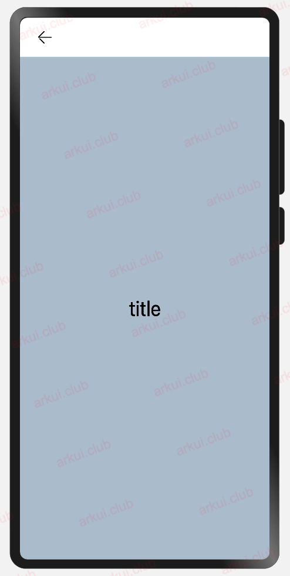

# Navigation
本文档基于OpenHarmony5.0版本 但我的测试SDK为API 11 
1. [Introduction](#introduction)
2. [简单案例](#简单案例)
3. [Navigation属性介绍](#navigation属性介绍)
## introduction
Navigation 组件一般作为**页面布局的根容器**，它提供了一系列属性方法来设置页面的**标题栏**、**工具栏**以及**菜单栏**的各种展示样式。

## 简单案例
Navigation 的定义不需要传递相关参数，我们先看下 Navigation 的最简单样例：

{width=150}

```typescript
Navigation() {                         // Navigation只能包含一个子组件
  Text('title')
    .textAlign(TextAlign.Center)
    .fontSize(30)
    .width('100%')
    .backgroundColor('#aabbcc')
}
.size({width: '100%', height: '100%'}) // Navigation只设置了size，没有设置任何其它属性
```

## Navigation属性介绍
