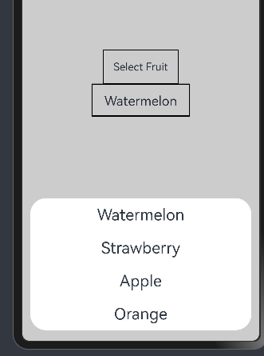

# Functions

1. [横竖屏控制变量island](#横竖屏控制变量island)
2. [不同页面路由传参以对象为例子](#不同页面路由传参以对象为例子)
3. [自定义列表弹窗传参案例](#自定义列表弹窗传参案例)

## 横竖屏控制变量island
### Effect:
设备窗口为竖屏的时候isLand状态变量值为False，为横屏的时候为True

### 第一步：import相关库  
```typescript
import mediaQuery from '@ohos.mediaquery'
```

### 第二步：定义媒体查询监听器以及isLand状态变量
```typescript
private listener = mediaQuery.matchMediaSync('screen and (min-aspect-ratio: 1.5) or (orientation: landscape)')
@State isLand: boolean = false
```

### 第三步：在组件内声明onLand方法
```typescript 
  onLand(mediaQueryResult) {
    // Logger.info(`${TAG} onLand: mediaQueryResult.matches=${mediaQueryResult.matches}`)
    if (mediaQueryResult.matches) {
    //  Logger.info('isLand', `True`)
      this.isLand = true
    } else {
    //  Logger.info('isLand', `False`)
      this.isLand = false
    }
  }
```

### 第四步：组件生命周期方法 aboutToAppear 中绑定 change 事件
```typescript
aboutToAppear() {
    this.listener.on('change', this.onLand.bind(this))
}
```

> 当屏幕的方向或比例变化时，listener 会触发 change 事件，调用 onLand 方法。

> onLand 会将 mediaQueryResult.matches 的值更新到 isLand，从而控制页面是横屏显示（isLand = true）还是竖屏显示（isLand = false）。

## 不同页面路由传参以对象为例子
### 第一步：import相关库  
```typescript
import router from '@ohos.router'
```

### 第二步：创建要传入的参数的对象类
```typescript
export class People {
  name: string;
  id: number;
  age: number;

  constructor(name: string, id: number, age: number) {
    this.name = name;
    this.id = id;
    this.age = age;
  }
}
```

### 第三步：在第一个页面创建对象实例并调用 router.pushUrl()方法
```
@Entry
@Component
struct Index {
   people = new People("John Doe", 2, 25)
  build() {
    Row() {
      Column() {
        Button('Next Page')
          .onClick(()=>{
            router.pushUrl({
              url: 'pages/Page2',
              params:{
                age: this.people.age,
                id: this.people.id,
                name: this.people.name
              }
            })
          })
      }
      .width('100%')
    }
    .height('100%')
  }
}
```
> 注意1: 在router的params参数列表中的每个变量的名称必须和传入类保持一致

> 注意2：确保第二个页面在module.json5中声明

### 第四步：在第二个页面调用router.getParams()方法
```typescript
import router from '@ohos.router';
import { People } from './Index'
@Entry
@Component
struct Page2 {

  people!:People

  aboutToAppear(): void {
  const params = router.getParams() as People
    this.people = params
  }

  build() {
    Row() {
      Column() {
        Text(this.people.id.toString())
        Text(this.people.age.toString())
        Text(this.people.name)
      }
      .width('100%')
    }
    .height('100%')
  }
}
```
> 注意1: 接收的params要声明类型，上面例子中为 `const params = router.getParams() as People`

> 注意2：可以在第二个页面即将出现的时候渲染，调用aboutToAppear()方法

## 自定义列表弹窗传参案例

### Effect
<div>
        
</div>

```typescript
import { MyDataSource } from '../common/myData'

@Preview
@CustomDialog
struct CustomDialogList {
  controller: CustomDialogController
  private menu: Array<string> = ['Watermelon', 'Strawberry', 'Apple']
  action!: (value: string) => void

  build() {
    Column() {
      LazyForEach(new MyDataSource(this.menu), (item: string) => {

        Text(item)
          .height(50)
          .padding(10)
          .fontSize(24)
          .textAlign(TextAlign.Center)
          .textOverflow({ overflow: TextOverflow.None })

          .onClick(() => {
            this.controller.close()
            this.action(item)
          })
      }, (item: string) => JSON.stringify(item))
    }
  }
}

@Entry
@Component
struct Index {
  private index: number = 0;
  private menu: Array<string> = ['Watermelon', 'Strawberry', 'Apple', 'Orange']
  @State @Watch('amountChange') select: string = '';
  @State @Watch('amountChange') amount: number = 0;
  private selectStuff!: (index: number, good: string, count: number) => void;
  dialogController: CustomDialogController = new CustomDialogController({
    builder: CustomDialogList({
      menu: this.menu,
      action: this.action.bind(this)
    }),
    autoCancel: false
  })

  amountChange() {
    if (this.select != undefined) {
      this.selectStuff(this.index, this.select, this.amount);
    }
  }

  action(value: string) {
    this.select = value;
  }

  build() {
    Row() {
      Column() {

        Text('Select Fruit')
          .onClick(() => {
            this.dialogController.open()
          })
          .border({
            width: 1
          })
          .padding(15)

        Text(this.select)
          .height(50)
          .width(150)
          .padding(12)
          .fontSize(20)
          .textAlign(TextAlign.Center)
          .border({ width: 2, color: Color.Black })
          .textOverflow({ overflow: TextOverflow.None })
      }
      .width('100%')
    }
    .height('100%')
  }
}
```
