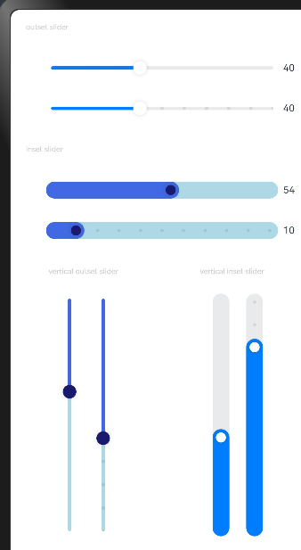

```typescript
@Entry
@Component
struct SliderExample {
  @State outSetValueOne: number = 40
  @State inSetValueOne: number = 40
  @State outSetValueTwo: number = 40
  @State inSetValueTwo: number = 40
  @State vOutSetValueOne: number = 40
  @State vInSetValueOne: number = 40
  @State vOutSetValueTwo: number = 40
  @State vInSetValueTwo: number = 40

  build() {
    Column({ space: 8 }) {
      Text('outset slider').fontSize(9).fontColor(0xCCCCCC).width('90%').margin(15)
      Row() {
        Slider({
          value: this.outSetValueOne,
          min: 0,
          max: 100,
          style: SliderStyle.OutSet
        })
          .showTips(true)
          .onChange((value: number, mode: SliderChangeMode) => {
            this.outSetValueOne = value
            console.info('value:' + value + 'mode:' + mode.toString())
          })
        // toFixed(0)将滑动条返回值处理为整数精度
        Text(this.outSetValueOne.toFixed(0)).fontSize(12)
      }
      .width('80%')
      Row() {
        Slider({
          value: this.outSetValueTwo,
          step: 10,
          style: SliderStyle.OutSet
        })
          .showSteps(true)
          .onChange((value: number, mode: SliderChangeMode) => {
            this.outSetValueTwo = value
            console.info('value:' + value + 'mode:' + mode.toString())
          })
        Text(this.outSetValueTwo.toFixed(0)).fontSize(12)
      }
      .width('80%')

      Text('inset slider').fontSize(9).fontColor(0xCCCCCC).width('90%').margin(15)
      Row() {
        Slider({
          value: this.inSetValueOne,
          min: 0,
          max: 100,
          style: SliderStyle.InSet
        })
          .blockColor('#191970')
          .trackColor('#ADD8E6')
          .selectedColor('#4169E1')
          .showTips(true)
          .onChange((value: number, mode: SliderChangeMode) => {
            this.inSetValueOne = value
            console.info('value:' + value + 'mode:' + mode.toString())
          })
        Text(this.inSetValueOne.toFixed(0)).fontSize(12)
      }
      .width('80%')
      Row() {
        Slider({
          value: this.inSetValueTwo,
          step: 10,
          style: SliderStyle.InSet
        })
          .blockColor('#191970')
          .trackColor('#ADD8E6')
          .selectedColor('#4169E1')
          .showSteps(true)
          .onChange((value: number, mode: SliderChangeMode) => {
            this.inSetValueTwo = value
            console.info('value:' + value + 'mode:' + mode.toString())
          })
        Text(this.inSetValueTwo.toFixed(0)).fontSize(12)
      }
      .width('80%')

      Row() {
        Column() {
          Text('vertical outset slider').fontSize(9).fontColor(0xCCCCCC).width('50%').margin(15)
          Row() {
            Slider({
              value: this.vOutSetValueOne,
              style: SliderStyle.OutSet,
              direction: Axis.Vertical
            })
              .blockColor('#191970')
              .trackColor('#ADD8E6')
              .selectedColor('#4169E1')
              .showTips(true)
              .onChange((value: number, mode: SliderChangeMode) => {
                this.vOutSetValueOne = value
                console.info('value:' + value + 'mode:' + mode.toString())
              })
            Slider({
              value: this.vOutSetValueTwo,
              step: 10,
              style: SliderStyle.OutSet,
              direction: Axis.Vertical
            })
              .blockColor('#191970')
              .trackColor('#ADD8E6')
              .selectedColor('#4169E1')
              .showSteps(true)
              .onChange((value: number, mode: SliderChangeMode) => {
                this.vOutSetValueTwo = value
                console.info('value:' + value + 'mode:' + mode.toString())
              })
          }
        }.width('50%').height(300)

        Column() {
          Text('vertical inset slider').fontSize(9).fontColor(0xCCCCCC).width('50%').margin(15)
          Row() {
            Slider({
              value: this.vInSetValueOne,
              style: SliderStyle.InSet,
              direction: Axis.Vertical,
              reverse: true // 竖向的Slider默认是上端是min值，下端是max值，因此想要从下往上滑动，需要设置reverse为true
            })
              .showTips(true)
              .onChange((value: number, mode: SliderChangeMode) => {
                this.vInSetValueOne = value
                console.info('value:' + value + 'mode:' + mode.toString())
              })
            Slider({
              value: this.vInSetValueTwo,
              step: 10,
              style: SliderStyle.InSet,
              direction: Axis.Vertical,
              reverse: true
            })
              .showSteps(true)
              .onChange((value: number, mode: SliderChangeMode) => {
                this.vInSetValueTwo = value
                console.info('value:' + value + 'mode:' + mode.toString())
              })
          }
        }.width('50%').height(300)
      }
    }.width('100%')
  }
}
```
