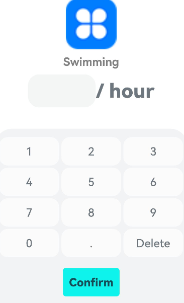

## Workout Logbook application


Problem faced during development
1. [Implement the use of DatePicker](#implement-the-use-of-datepicker)
2. [Require Panel to choose sport exercise duration](#require-panel-to-choose-sport-exercise-duration)


## Implement the use of datePicker

#### Background
For the index page of the program we need to add a calender icon, once user click it, it should pop out a dialog for user to select the date for the exercise.

#### Way of implementation
##### Step 1
Construct the frame of the calender page
```typescript
@CustomDialog
struct CalenderDialog {
  controller: CustomDialogController = new CustomDialogController({
    builder: CalenderDialog()
  })
  build() {
    column(){
        Text("Calender information pop up")
    }
  }
}
```

##### Step 2 
Add controller to the index page and link it to the calender icon  

```typescript
  dateSelectionController: CustomDialogController = new CustomDialogController({
    builder: DateDialog({
      date: new Date(this.date)
    })
  })
  calenderDialogController: CustomDialogController = new CustomDialogController({
    builder: CalenderDialog({})
  })
```
## Require Panel to choose sport exercise duration
#### Requirement description
In order to let users easier select the exercise duration, it's good to add a keyboard on the page as follows.


#### Implementation
code as following:
```typescript
  @Builder
  confirmButton(text: string, color: ResourceColor | string, onClick: ((event: ClickEvent) => void)) {
    //required varaible and data
  @State show: boolean = true
  keyboardArray: string[] = ['1', '2', '3', '4', '5', '6', '7', '8', '9', '0', '.']
  controller: CustomDialogController

    // confirm button
    Button() {
      Text(text)
        .fontSize(20)
        .fontWeight(800)
        .opacity(0.9)
    }
    .width(100)
    .height(50)
    .type(ButtonType.Normal)
    .backgroundColor(color)
    .borderRadius(5)
    .padding({ left: 5, right: 5 })
    .margin({top: 15})
  }

// Use Panel in this case
  Panel(this.show) {
  Column() {
    Grid() {
      ForEach(this.keyboardArray, (item: string) => {
        GridItem() {
          Text(item)
            .fontSize(20)
            .fontWeight(500)
        }
        .keyboardButtonStyle()
        .onClick(() => {
          // todo: add keyboard click event
        })
      })

      GridItem() {
        Text('Delete')
          .fontSize(20)
          .fontWeight(500)
      }
      .keyboardButtonStyle()
      .onClick(() => {
        // todo: add delete button click event
      })

      GridItem() {
        this.confirmButton('Confirm', '#ff0ef3eb', () => {
          this.show == false
        })
      }
      .columnStart(0)
      .columnEnd(2)

    }
    .columnsTemplate('1fr 1fr 1fr')
    .columnsGap(4)
    .rowsGap(4)
    .width('95%')
    .padding({ top: 15 })
  }
}
.mode(PanelMode.Half)
.halfHeight(1050)
.type(PanelType.Temporary)
.dragBar(false)
.width('100%')
```


